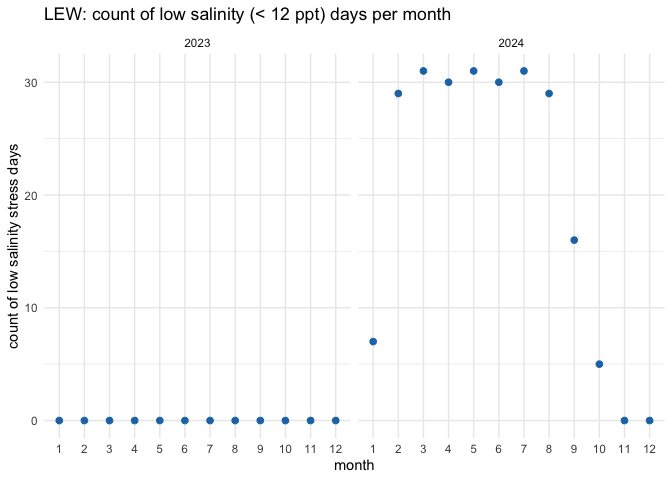

LEW Experimental site - Processed Environmental Data
================
Madeline Eppley
02/26/2025

``` r
setwd("/Users/madelineeppley/GitHub/MVP-H2F-HatcheryField/data/environment")
```

### Load required packages.

``` r
library("dplyr") #Used for working with data frames
```

    ## 
    ## Attaching package: 'dplyr'

    ## The following objects are masked from 'package:stats':
    ## 
    ##     filter, lag

    ## The following objects are masked from 'package:base':
    ## 
    ##     intersect, setdiff, setequal, union

``` r
library("lubridate") #Used for time-date conversions
```

    ## 
    ## Attaching package: 'lubridate'

    ## The following objects are masked from 'package:base':
    ## 
    ##     date, intersect, setdiff, union

``` r
library("readr") #Used to read the CSV file
library("ggplot2") 
```

### Note the date of data download and source. All available data should be used for each site regardless of year. Note from the CSV file how often the site was sampled, and if there are replicates in the data. Also describe if the sampling occurred at only low tide, only high tide, or continuously.

``` r
#Data was downloaded on 05/10/2024 for 2023 data, 2/26/2025 for 2024 data
#Source - Dr. William "Willy" Reay of VIMS shared the file with Jess Small, KEL, ME, and NM via email. 
#The site was sampled continuously every 15 min from May 2023 to April 2024 and for the entire 2024 year. 

#Create text strings with metadata information that we want to include in the final data frame. 
download_date <- ("02-26-2025")
source_description <- ("VIMS - William Reay")
site_name <- ("LEW") 
collection_type <- ("continuous")
```

### Use the file path name in your working directory or desktop, see example below. Or, import data set through the “Files” window in R studio. Store the file in a variable with the “raw_ID_Site” format. If salinity and temperature data are in separate files, read in both and store them with “\_sal” or “\_temp” in the variable names.

``` r
#The files we will be working with are from the Coan River, VA, which is for the LEW selection line. The ID_Site for this site is LEW. 

#set working directory to files location
setwd("/Users/madelineeppley/GitHub/MVP-H2F-HatcheryField/data/environment")

#merge files into one
raw_LEW <- read.csv("/Users/madelineeppley/GitHub/MVP-H2F-HatcheryField/data/environment/LEW-raw.csv")

#The data include separate columns for date and time, which I want to merge into one.
raw_LEW$datetime <- paste(raw_LEW$Date, raw_LEW$EST.Time)

#Remove Date and EST.Time columns, as well as depth column.
raw_LEW <- subset(raw_LEW, select = -c(Date, EST.Time, Depth))

#Reorder columns so datetime is first
raw_LEW <- raw_LEW[, c(3,1,2)]


# View how the data are stored. Note the variable names and the format and units that the data are stored in.  
summary(raw_LEW)
```

    ##    datetime              Temp           Salinity    
    ##  Length:58640       Min.   : 0.513   Min.   : 7.20  
    ##  Class :character   1st Qu.:11.200   1st Qu.:10.80  
    ##  Mode  :character   Median :19.700   Median :13.30  
    ##                     Mean   :18.438   Mean   :13.11  
    ##                     3rd Qu.:25.300   3rd Qu.:15.60  
    ##                     Max.   :31.500   Max.   :18.10  
    ##                     NA's   :334      NA's   :340

``` r
#rename columns. "datetime" = date and time of data collection, "temp" = water temperature in degrees C, "salinity" = water salinity in parts per thousand (ppt)

colnames(raw_LEW) <- c("datetime", "temp", "salinity")
```

### Start with the date and time of collection. We will use the lubridate package to standardize all values into the date-time format called POSIXct. This format stores the date and time in number of seconds since a past point (1/1/1970). This makes comparisons easy and helps to standardizes values.

``` r
#Convert to POSIXct format. Tell R what the current date/time format is so it knows how to convert it. Store it into a column named datetime in the data frame.
raw_LEW$datetime <- as.POSIXct(raw_LEW$datetime, "%m/%d/%y %H:%M:%S", tz = "")

#Print the new data frame and examine to make sure the new datetime column is in the correct format. 
head(raw_LEW)
```

    ##              datetime temp salinity
    ## 1 2023-05-01 00:00:00 17.8     14.6
    ## 2 2023-05-01 00:15:00 17.7     14.8
    ## 3 2023-05-01 00:30:00 17.7     14.8
    ## 4 2023-05-01 00:45:00 17.9     14.5
    ## 5 2023-05-01 01:00:00 17.9     14.6
    ## 6 2023-05-01 01:15:00 17.8     14.6

``` r
#Print the new data frame and examine to make sure the new datetime column is in the correct format. 
summary(raw_LEW$datetime)
```

    ##                       Min.                    1st Qu. 
    ## "2023-05-01 00:00:00.0000" "2023-09-30 16:37:30.0000" 
    ##                     Median                       Mean 
    ## "2024-03-01 09:15:00.0000" "2024-03-01 10:47:56.4851" 
    ##                    3rd Qu.                       Max. 
    ## "2024-08-01 07:07:30.0000" "2024-12-31 23:45:00.0000" 
    ##                       NA's 
    ##                        "5"

``` r
# we have NAs, so remove those
raw_LEW <- raw_LEW %>%
    filter(!is.na(datetime))
summary(raw_LEW$datetime)
```

    ##                       Min.                    1st Qu. 
    ## "2023-05-01 00:00:00.0000" "2023-09-30 16:37:30.0000" 
    ##                     Median                       Mean 
    ## "2024-03-01 09:15:00.0000" "2024-03-01 10:47:56.4851" 
    ##                    3rd Qu.                       Max. 
    ## "2024-08-01 07:07:30.0000" "2024-12-31 23:45:00.0000"

``` r
# double check that the NA removal worked
summary(raw_LEW$datetime)
```

    ##                       Min.                    1st Qu. 
    ## "2023-05-01 00:00:00.0000" "2023-09-30 16:37:30.0000" 
    ##                     Median                       Mean 
    ## "2024-03-01 09:15:00.0000" "2024-03-01 10:47:56.4851" 
    ##                    3rd Qu.                       Max. 
    ## "2024-08-01 07:07:30.0000" "2024-12-31 23:45:00.0000"

## Set up data frames for violin plots

``` r
#add site name and create new data frame with full envr data set
#LEW_full <- raw_LEW %>% 
  #mutate(site_name, site_name = "LEW")

#reorder columns with site_name first
#LEW_full <- LEW_full[, c(4, 1, 2, 3)]

#separate out salinity and temp data into new frames for other analyses
#LEW_temp_full <- LEW_full[, c(1,2,3)]

#LEW_sal_full <- LEW_full[, c(1,2,4)]

#save LEW  as csvs for future analyses
#write.csv(LEW_temp_full, "/Users/nicolemongillo/Desktop/GitHub/MVP_Chesapeake_VIMS_hatchery/data/envr_raw_data/full_datasets/full_temp/LEW_temp_full.csv", row.names = FALSE)

#write.csv(LEW_sal_full, "/Users/nicolemongillo/Desktop/GitHub/MVP_Chesapeake_VIMS_hatchery/data/envr_raw_data/full_datasets/full_sal/LEW_sal_full.csv", row.names = FALSE)
```

### \#Standardize column and variable names. We will use “lat” for latitude in degrees, and “lon” for longitude in degrees.

``` r
#Standardize column and variable names. We will use "temp" for temperature in degrees C, "salinity" for salinity in parts per thousand (ppt), "lat" for latitude in degrees, and "lon" for longitude in degrees. 
#Use the dyplr format to rename multiple columns in the format "dataframe %>% rename("new name 1" = "old name 1", "new name 2", "old name 2")
#raw_LEW <- raw_LEW %>% rename("temp" = "Temp", "salinity" = "Sal") #No lat and long data in this file - check metadata files, also no need to remanme since columns are already ok

#Print the range (minimum and maximum) of dates of data collection. 
print(range(raw_LEW$datetime))
```

    ## [1] "2023-05-01 00:00:00 EDT" "2024-12-31 23:45:00 EST"

``` r
#Print the range (minimum and maximum) of the salinity values. 
print(summary(raw_LEW$salinity))
```

    ##    Min. 1st Qu.  Median    Mean 3rd Qu.    Max.    NA's 
    ##    7.20   10.80   13.30   13.11   15.60   18.10     339

``` r
#Print the range (minimum and maximum) of the temperature values.
print(summary(raw_LEW$temp))
```

    ##    Min. 1st Qu.  Median    Mean 3rd Qu.    Max.    NA's 
    ##   0.513  11.200  19.700  18.438  25.300  31.500     333

``` r
#Store variables that we will include in the final data frame
lat <- 37.9803
lon <- -76.4619
#Lat and long data are from this site(https://www.vims.edu/cbnerr/monitoring/water_quality/). Data came from the KCB hatchery in the Coan as part of the CBNERR water quality monitoring initiative.
firstyear <- 2023
finalyear <- 2024
```

### Filter any of the variables that have data points outside of normal range. We will use 0-40 as the accepted range for salinity (ppt) and temperature (C) values. Note, in the summer, salinity values can sometimes exceed 40. Check to see if there are values above 40. In this case, adjust the range or notify someone that the site has particularly high salinity values.

``` r
#Filter the data between the values of 0 and 40 for both salinity and temperature. 
filtered_LEW <- raw_LEW %>%
    filter(between(salinity, 0, 40)) 
           
filtered_LEW <- filtered_LEW %>%
    filter(between(temp, 0, 40))

# Sanity check - print the ranges to ensure values are filtered properly. We can see that the ranges for both are now in the appropriate range.  
print(summary(filtered_LEW$salinity))
```

    ##    Min. 1st Qu.  Median    Mean 3rd Qu.    Max. 
    ##    7.20   10.80   13.30   13.11   15.60   18.10

``` r
print(summary(filtered_LEW$temp))
```

    ##    Min. 1st Qu.  Median    Mean 3rd Qu.    Max. 
    ##   0.513  11.200  19.700  18.438  25.300  31.500

``` r
#Store our data into a variable name with just the site name. 
LEW <- filtered_LEW
```

### Visualize the salinity, temperature, and date ranges over time. This can help us see if there are any anomalies or gaps in the data and make sure the filtering was done correctly. Sanity check - do the temperature and salinity ranges look appropriate for the geography of the site (ex. near full ocean salinity for coastal sites, lower salinity for estuaries or near rivers)?

``` r
salplot <- ggplot(LEW, aes(x = datetime)) +
    geom_line(aes(y = salinity, color = "Salinity (ppt)")) +
    ylim(0,40) +
    labs(x = "Time", y = "Salinity ppt", title = "Salinity Plot for LEW - Coan River, Virginia") +
    scale_color_manual(values = c("Salinity (ppt)" = "blue")) +
    theme_minimal()


salplot
```

<!-- -->

``` r
tempplot <- ggplot(LEW, aes(x = datetime)) +
    geom_line(aes(y = temp, color = "Temperature (C)")) +
    ylim(0, 40) +
    labs(x = "Time", y = "Temperature C", title = "Temperature Plot for LEW - Coan River, Virginia") +
    scale_color_manual(values = c( "Temperature (C)" = "red")) +
    theme_minimal()

tempplot
```

<!-- -->

### We need to calculate the mean, maximum, and minimum values for salinity and temperature per month and year. First make two data frames to contain each of the annual and monthly averages.

``` r
#Calculate the mean, maximum, and minimum values for salinity and temperature for each month. 
LEW_envrmonth <- LEW %>%
    mutate(year = year(datetime), month = month(datetime)) %>%
    group_by(year, month) %>%
    summarise(
      min_salinity = min(salinity),
      max_salinity = max(salinity),
      mean_salinity = mean(salinity),
      length_salinity = length(salinity),
      min_temp = min(temp),
      max_temp = max(temp),
      mean_temp = mean(temp),
      length_temp = length(temp))
```

    ## `summarise()` has grouped output by 'year'. You can override using the
    ## `.groups` argument.

``` r
print(LEW_envrmonth)
```

    ## # A tibble: 20 × 10
    ## # Groups:   year [2]
    ##     year month min_salinity max_salinity mean_salinity length_salinity min_temp
    ##    <dbl> <dbl>        <dbl>        <dbl>         <dbl>           <int>    <dbl>
    ##  1  2023     5        12.2          14.8         13.3             2973   15.4  
    ##  2  2023     6        12.4          16           13.6             2873   19.8  
    ##  3  2023     7        13.5          16.6         14.7             2975   23.7  
    ##  4  2023     8        14.5          16.6         15.6             2975   24.8  
    ##  5  2023     9        14.9          16.3         15.8             2878   19.2  
    ##  6  2023    10        14.9          17.5         15.8             2976   15    
    ##  7  2023    11        16.5          18.1         17.4             2880    6.5  
    ##  8  2023    12        14            18           16.4             2976    6.3  
    ##  9  2024     1        11.8          15.6         13.5             2722    0.513
    ## 10  2024     2         7.91         12.4         10.3             2784    5.59 
    ## 11  2024     3         7.8          12.3          9.58            2971    7.91 
    ## 12  2024     4         7.78          9.9          8.40            2863   10.6  
    ## 13  2024     5         7.3          11.2          8.30            2975   17    
    ## 14  2024     6         7.2          11.6          9.38            2821   22.1  
    ## 15  2024     7         9.8          12.1         10.8             2976   25.6  
    ## 16  2024     8         8.8          13.7         11.8             2974   24.4  
    ## 17  2024     9        11.3          13.9         12.4             2875   22.3  
    ## 18  2024    10        11            16.3         13.0             2975   14.8  
    ## 19  2024    11        14            16.5         15.4             2879    8.8  
    ## 20  2024    12        15.4          17.5         16.5             2975    3.5  
    ## # ℹ 3 more variables: max_temp <dbl>, mean_temp <dbl>, length_temp <int>

``` r
#Calculate the mean, maximum, and minimum values for salinity and temperature for each year. 
LEW_envryear <- LEW %>%
    mutate(year = year(datetime)) %>%
    group_by(year) %>%
    summarise(
      min_salinity = min(salinity),
      max_salinity = max(salinity),
      mean_salinity = mean(salinity),
      min_temp = min(temp),
      max_temp = max(temp),
      mean_temp = mean(temp))

print(LEW_envryear)
```

    ## # A tibble: 2 × 7
    ##    year min_salinity max_salinity mean_salinity min_temp max_temp mean_temp
    ##   <dbl>        <dbl>        <dbl>         <dbl>    <dbl>    <dbl>     <dbl>
    ## 1  2023         12.2         18.1          15.3    6.3       31.5      20.4
    ## 2  2024          7.2         17.5          11.6    0.513     31.2      17.1

``` r
#Calculate the mean, maximum, and minimum values for salinity and temperature for each day. 
LEW_envrday <- LEW %>%
    mutate(year = year(datetime), month = month(datetime), day = day(datetime)) %>%
    group_by(year, month, day) %>%
    summarise(
      min_salinity = min(salinity),
      max_salinity = max(salinity),
      mean_salinity = mean(salinity),
      length_salinity = length(salinity),
      min_temp = min(temp),
      max_temp = max(temp),
      mean_temp = mean(temp),
      length_temp = length(temp))
```

    ## `summarise()` has grouped output by 'year', 'month'. You can override using the
    ## `.groups` argument.

``` r
print(LEW_envrday)
```

    ## # A tibble: 609 × 11
    ## # Groups:   year, month [20]
    ##     year month   day min_salinity max_salinity mean_salinity length_salinity
    ##    <dbl> <dbl> <int>        <dbl>        <dbl>         <dbl>           <int>
    ##  1  2023     5     1         13.7         14.8          14.2              96
    ##  2  2023     5     2         13.8         14.7          14.2              96
    ##  3  2023     5     3         13.8         14.7          14.3              96
    ##  4  2023     5     4         13.7         14.5          14.2              96
    ##  5  2023     5     5         13.9         14.5          14.2              96
    ##  6  2023     5     6         14           14.3          14.2              96
    ##  7  2023     5     7         13.7         14.4          14.1              96
    ##  8  2023     5     8         13.6         14.2          14.0              96
    ##  9  2023     5     9         13.7         14            13.8              96
    ## 10  2023     5    10         13.7         13.8          13.7              94
    ## # ℹ 599 more rows
    ## # ℹ 4 more variables: min_temp <dbl>, max_temp <dbl>, mean_temp <dbl>,
    ## #   length_temp <int>

### Plot the months and years of data collection to check if there are any collection gaps in the data.

``` r
timeplot <- ggplot(LEW_envrmonth, aes(x = year)) +
    geom_point(aes(y = month, color = length_salinity), size = 4) +
    labs(x = "Time", y = "Month", title = "Salinity Timeplot for LEW - Coan River, Virginia") +
    ylim(1,12) +
    theme_minimal()

timeplot
```

<!-- -->

# Calculate days above and below thresholds and plot

``` r
# open up a blank data frame that spans all 12 months for all years of data collection for this site
# we will merge this with the observations so that we can plot over time 

complete_year_month <- expand.grid(
  year = unique(firstyear:finalyear),
  month = 1:12
)
```

# start with low salinity stress

``` r
# first calculate for low salinity
LEW$low_sal_stress <- LEW$salinity < 12

low_sal_stress_count <- LEW %>%
  mutate(year = year(datetime), 
         month = month(datetime), 
         day = day(datetime)) %>% 
  filter(low_sal_stress == 1) %>%  
  distinct(year, month, day) %>%  # remove dups
  group_by(year, month) %>%
  summarise(low_sal_stress = n(), .groups = "drop") # group all occurrences together by month rather than by numeric day

print(low_sal_stress_count)
```

    ## # A tibble: 10 × 3
    ##     year month low_sal_stress
    ##    <dbl> <dbl>          <int>
    ##  1  2024     1              7
    ##  2  2024     2             29
    ##  3  2024     3             31
    ##  4  2024     4             30
    ##  5  2024     5             31
    ##  6  2024     6             30
    ##  7  2024     7             31
    ##  8  2024     8             29
    ##  9  2024     9             16
    ## 10  2024    10              5

``` r
# this plots low sal stress days only, years with no observations of low salinity stress will not appear in the graph 
ggplot(low_sal_stress_count, aes(x = factor(month), y = low_sal_stress, fill = factor(month))) +
  geom_bar(stat = "identity", fill = "#1f77b4") +
  facet_wrap(~ year) +
  labs(title = "LEW: count of low salinity (< 12 ppt) days per month",
       x = "month",
       y = "count of days") +
  theme_minimal()
```

<!-- -->

``` r
# Merge with the original dataset, filling missing values with 0 for low_sal_stress
low_sal_complete_data <- complete_year_month %>%
  left_join(low_sal_stress_count, by = c("year", "month")) %>%
  mutate(low_sal_stress = ifelse(is.na(low_sal_stress), 0, low_sal_stress))

low_sal_complete_data$month <- as.numeric(low_sal_complete_data$month)

# bars
ggplot(low_sal_complete_data, aes(x = factor(month), y = low_sal_stress)) +
  geom_bar(stat = "identity", fill = "#1f77b4") + 
  facet_wrap(~ year) +
  labs(title = "LEW: count of low salinity (< 12 ppt) days per month",
       x = "month",
       y = "count of low salinity stress days") +
  theme_minimal()
```

<!-- -->

``` r
# points
ggplot(low_sal_complete_data, aes(x = factor(month), y = low_sal_stress)) +
  geom_point(color = "#1f77b4", size = 2) + 
  facet_wrap(~ year) +  
  labs(title = "LEW: count of low salinity (< 12 ppt) days per month",
       x = "month",
       y = "count of low salinity stress days") +
  theme_minimal()
```

<!-- -->

# now calculate for high salinity stress

``` r
LEW$high_sal_stress <- LEW$salinity > 35

high_sal_stress_count <- LEW %>%
  mutate(year = year(datetime), 
         month = month(datetime), 
         day = day(datetime)) %>% 
  filter(high_sal_stress == 1) %>%  
  distinct(year, month, day) %>%  # remove dups
  group_by(year, month) %>%
  summarise(high_sal_stress = n(), .groups = "drop") # group all occurrences together by month rather than by numeric day

print(high_sal_stress_count) # no high sal stress 
```

    ## # A tibble: 0 × 3
    ## # ℹ 3 variables: year <dbl>, month <dbl>, high_sal_stress <int>

# high temp stress calculations

``` r
LEW$high_temp_stress <- LEW$temp > 28

high_temp_stress_count <- LEW %>%
  mutate(year = year(datetime), 
         month = month(datetime), 
         day = day(datetime)) %>% 
  filter(high_temp_stress == 1) %>%  
  distinct(year, month, day) %>%  # remove dups
  group_by(year, month) %>%
  summarise(high_temp_stress = n(), .groups = "drop") # group all occurrences together by month rather than by numeric day

print(high_temp_stress_count)
```

    ## # A tibble: 7 × 3
    ##    year month high_temp_stress
    ##   <dbl> <dbl>            <int>
    ## 1  2023     7               27
    ## 2  2023     8               22
    ## 3  2023     9                8
    ## 4  2024     6               11
    ## 5  2024     7               30
    ## 6  2024     8               19
    ## 7  2024     9                1

``` r
ggplot(high_temp_stress_count, aes(x = factor(month), y = high_temp_stress, fill = factor(month))) +
  geom_bar(stat = "identity", fill = "#DD4124FF") +
  facet_wrap(~ year) +
  labs(title = "LEW: count of high temperature (> 28 C) days per month",
       x = "month",
       y = "count of days") +
  theme_minimal()
```

<!-- -->

``` r
high_temp_complete_data <- complete_year_month %>%
  left_join(high_temp_stress_count, by = c("year", "month")) %>%
  mutate(high_temp_stress = ifelse(is.na(high_temp_stress), 0, high_temp_stress))

high_temp_complete_data$month <- as.numeric(high_temp_complete_data$month)

# bars
ggplot(high_temp_complete_data, aes(x = factor(month), y = high_temp_stress)) +
  geom_bar(stat = "identity", fill = "#DD4124FF") + 
  facet_wrap(~ year) +
  labs(title = "LEW: count of high temperature (> 28 C) days per month",
       x = "month",
       y = "count of days") +
  theme_minimal()
```

<!-- -->

``` r
# points
ggplot(high_temp_complete_data, aes(x = factor(month), y = high_temp_stress)) +
  geom_point(color = "#DD4124FF", size = 2) + 
  facet_wrap(~ year) +  
  labs(title = "LEW: count of high temperature (> 28 C) days per month",
       x = "month",
       y = "count of days") +
  theme_minimal()
```

<!-- -->

### We can now calculate a list of variables that we will have collected for all sites. This will allow us to compare sites easily. We will calculate the number of observations from each site, the mean annual, maximum annual, and minimum annual value for all variables.

Our list of variables includes:

- Mean_Annual_Temperature_C: average of all available data

- Mean_max_temperature_C: average of maximums for each year

- Mean_min_temperature_C: average of minimums for each year

- Temperature_st_dev: standard deviation of all available data

- Temperature_n: total number of data points

- Temperature_years: number of years in data set

- Mean_Annual_Salinity_ppt: average of all available data

- Mean_min_Salinity_ppt: average of minimums for each year

- Mean_max_Salinity_ppt: average of maximums for each year

- Salinity_st_dev: standard deviation of all available data

- Salinity_n: total number of data points

- Salinity_years: number of years in data set

``` r
#Calculate temperature variables. 
Mean_Annual_Temperature_C <- mean(LEW$temp)
Mean_max_temperature_C <- mean(LEW_envryear$max_temp)
Mean_min_temperature_C <- mean(LEW_envryear$min_temp)
Temperature_st_dev <- sd(LEW$temp)
Temperature_n <- nrow(LEW)
Temperature_years <- nrow(LEW_envryear)
high_temp_stress_days <- sum(high_temp_stress_count$high_temp_stress)
frac_high_temp_stress_days <- high_temp_stress_days/nrow(LEW_envrday)

Mean_Monthly_Temperature_C <- LEW_envrmonth %>%
  filter(!is.na(month)) %>% 
  group_by(month) %>%
  summarise(Mean_Temperature = mean(mean_temp))

Mean_min_Monthly_Temperature_C <- LEW_envrmonth %>%
  filter(!is.na(month)) %>% 
  group_by(month) %>%
  summarise(Mean_min_Temperature = mean(min_temp))

Mean_max_Monthly_Temperature_C <- LEW_envrmonth %>%
  filter(!is.na(month)) %>% 
  group_by(month) %>%
  summarise(Mean_max_Temperature = mean(max_temp))

#Create a data frame to store the temperature results
LEW_temp <- cbind(site_name, download_date, source_description, lat, lon, firstyear, finalyear, Mean_Annual_Temperature_C, Mean_max_temperature_C, Mean_min_temperature_C, Temperature_st_dev, high_temp_stress_days, frac_high_temp_stress_days, Temperature_n, Temperature_years, collection_type)
print(LEW_temp)
```

    ##      site_name download_date source_description    lat       lon       
    ## [1,] "LEW"     "02-26-2025"  "VIMS - William Reay" "37.9803" "-76.4619"
    ##      firstyear finalyear Mean_Annual_Temperature_C Mean_max_temperature_C
    ## [1,] "2023"    "2024"    "18.4378261973377"        "31.35"               
    ##      Mean_min_temperature_C Temperature_st_dev high_temp_stress_days
    ## [1,] "3.4065"               "7.85765319567894" "118"                
    ##      frac_high_temp_stress_days Temperature_n Temperature_years collection_type
    ## [1,] "0.19376026272578"         "58296"       "2"               "continuous"

``` r
LEW_monthly_temp <- cbind(Mean_Monthly_Temperature_C, Mean_min_Monthly_Temperature_C, Mean_max_Monthly_Temperature_C)
LEW_monthly_temp <- LEW_monthly_temp[, !duplicated(names(LEW_monthly_temp))]
print(LEW_monthly_temp)
```

    ##    month Mean_Temperature Mean_min_Temperature Mean_max_Temperature
    ## 1      1         5.579148                0.513                9.139
    ## 2      2         7.174113                5.593               10.061
    ## 3      3        10.718560                7.909               14.179
    ## 4      4        14.838457               10.643               20.000
    ## 5      5        20.443083               16.200               24.300
    ## 6      6        24.418784               20.950               28.400
    ## 7      7        28.345591               24.650               31.200
    ## 8      8        27.591326               24.600               30.650
    ## 9      9        24.179804               20.750               28.850
    ## 10    10        18.915095               14.900               23.550
    ## 11    11        13.265280                7.650               17.800
    ## 12    12         7.378249                4.900                9.800

``` r
# Write to the combined file with all sites 
write.table(LEW_temp, "/Users/madelineeppley/GitHub/MVP-H2F-HatcheryField/data/environment/all_temperature.csv", sep = ",", append = TRUE, col.names = FALSE, row.names = FALSE) # The column names should be changed to FALSE after 1st row is added to the data frame

# Write to a unique new CSV file
write.csv(LEW_temp, "/Users/madelineeppley/GitHub/MVP-H2F-HatcheryField/data/environment/LEW_temperature.csv")

# Write all montly data to a unique new CSV file
write.csv(LEW_monthly_temp, "/Users/madelineeppley/GitHub/MVP-H2F-HatcheryField/data/environment/LEW_monthly_temp.csv")
```

``` r
#Calculate the salinity variables
Mean_Annual_Salinity_ppt <- mean(LEW$salinity)
Mean_max_Salinity_ppt <- mean(LEW_envryear$max_salinity)
Mean_min_Salinity_ppt <- mean(LEW_envryear$min_salinity)
Salinity_st_dev <- sd(LEW$salinity)
Salinity_n <- nrow(LEW)
Salinity_years <- nrow(LEW_envryear)
high_sal_stress_days <- sum(high_sal_stress_count$high_sal_stress)
low_sal_stress_days <- sum(low_sal_stress_count$low_sal_stress)
frac_high_sal_stress_days <- high_sal_stress_days/nrow(LEW_envrday)
frac_low_sal_stress_days <- low_sal_stress_days/nrow(LEW_envrday)

Mean_Monthly_Salinity <- LEW_envrmonth %>%
  filter(!is.na(month)) %>%
  group_by(month) %>%
  summarise(Mean_Salinity = mean(mean_salinity))

Min_Monthly_Salinity <- LEW_envrmonth %>%
  filter(!is.na(month)) %>%
  group_by(month) %>%
  summarise(Min_Salinity = mean(min_salinity))

Max_Monthly_Salinity <- LEW_envrmonth %>%
  filter(!is.na(month)) %>%
  group_by(month) %>%
  summarise(Max_Salinity = mean(max_salinity))

#Create a data frame to store the temperature results
LEW_salinity <- cbind(site_name, download_date, source_description, lat, lon, firstyear, finalyear, Mean_Annual_Salinity_ppt, Mean_max_Salinity_ppt, Mean_min_Salinity_ppt, high_sal_stress_days,low_sal_stress_days, frac_high_sal_stress_days, frac_low_sal_stress_days, Salinity_st_dev, Salinity_n, Salinity_years, collection_type)
print(LEW_salinity)
```

    ##      site_name download_date source_description    lat       lon       
    ## [1,] "LEW"     "02-26-2025"  "VIMS - William Reay" "37.9803" "-76.4619"
    ##      firstyear finalyear Mean_Annual_Salinity_ppt Mean_max_Salinity_ppt
    ## [1,] "2023"    "2024"    "13.1104540620283"       "17.8"               
    ##      Mean_min_Salinity_ppt high_sal_stress_days low_sal_stress_days
    ## [1,] "9.7"                 "0"                  "239"              
    ##      frac_high_sal_stress_days frac_low_sal_stress_days Salinity_st_dev   
    ## [1,] "0"                       "0.392446633825944"      "2.86712352330663"
    ##      Salinity_n Salinity_years collection_type
    ## [1,] "58296"    "2"            "continuous"

``` r
LEW_monthly_sal <- cbind(Mean_Monthly_Salinity, Min_Monthly_Salinity, Max_Monthly_Salinity)
LEW_monthly_sal <- LEW_monthly_sal[, !duplicated(names(LEW_monthly_sal))]
print(LEW_monthly_sal)
```

    ##    month Mean_Salinity Min_Salinity Max_Salinity
    ## 1      1     13.493953        11.75        15.65
    ## 2      2     10.305524         7.91        12.37
    ## 3      3      9.580646         7.80        12.30
    ## 4      4      8.401505         7.78         9.90
    ## 5      5     10.805852         9.75        13.00
    ## 6      6     11.475236         9.80        13.80
    ## 7      7     12.785909        11.65        14.35
    ## 8      8     13.688608        11.65        15.15
    ## 9      9     14.081148        13.10        15.10
    ## 10    10     14.408088        12.95        16.90
    ## 11    11     16.402910        15.25        17.30
    ## 12    12     16.448600        14.70        17.75

``` r
# Write to the combined file with all sites 
write.table(LEW_salinity, "/Users/madelineeppley/GitHub/MVP-H2F-HatcheryField/data/environment/all_salinity.csv", sep = ",", append = TRUE, col.names = FALSE, row.names = FALSE) # The column names should be changed to FALSE after 1st row is added to the data frame

# Write all year data to a unique new CSV file
write.csv(LEW_salinity, "/Users/madelineeppley/GitHub/MVP-H2F-HatcheryField/data/environment/LEW_salinity.csv")
# Write all montly data to a unique new CSV file
write.csv(LEW_monthly_sal, "/Users/madelineeppley/GitHub/MVP-H2F-HatcheryField/data/environment/LEW_monthly_sal.csv")
```
