W1_TX - Processed Environmental Data
================
Madeline Eppley
7/7/2023

``` r
setwd("/Users/madelineeppley/GitHub/MVP-H2F-HatcheryField/data/environment")
```

### Load required packages.

``` r
library("dplyr") #Used for working with data frames
library("lubridate") #Used for time-date conversions
library("readr") #Used to read the CSV file
library("ggplot2")
```

### Note the date of data download and source. All available data should be used for each site regardless of year. Note from the CSV file how often the site was sampled, and if there are replicates in the data. Also describe if the sampling occurred at only low tide, only high tide, or continuously.

``` r
#Data was downloaded on 7/7/2023
#Source - https://cdmo.baruch.sc.edu//dges/ - Selected Mission Aransas, Copano Bay West. The station code is MARCWWQ.  

#Create text strings with metadata information that we want to include in the final data frame. 
download_date <- ("07-07-2023")
source_description <- ("NERR Centralized Data. Mission Aransas - Copano Bay West MARCWWQ")
site_name <- ("W1_TX") #Use site code with site number based on lat position and state
collection_type <- ("continuous")
```

### Use the file path name in your working directory or desktop, see example below. Or, import data set through the “Files” window in R studio. Store the file in a variable with the “raw_ID_Site” format. If salinity and temperature data are in separate files, read in both and store them with “\_sal” or “\_temp” in the variable names.

``` r
#The file we will be working with is from Copano Bay, Texas. The ID_Site for this site is W1_TX. 
raw_W1_TX <- read_csv("/Users/madelineeppley/GitHub/MVP-H2F-HatcheryField/data/environment/W1-TX-raw.csv")
```

    ## Rows: 523354 Columns: 30
    ## ── Column specification ─────────────────────────────────────────────────────────────────────────────────────────────────────
    ## Delimiter: ","
    ## chr (16): Station_Code, isSWMP, DateTimeStamp, F_Record, F_Temp, F_SpCond, F_Sal, F_DO_pct, F_DO_mgl, F_Depth, F_cDepth, ...
    ## dbl (14): Historical, ProvisionalPlus, Temp, SpCond, Sal, DO_pct, DO_mgl, Depth, cDepth, Level, cLevel, pH, Turb, ChlFluor
    ## 
    ## ℹ Use `spec()` to retrieve the full column specification for this data.
    ## ℹ Specify the column types or set `show_col_types = FALSE` to quiet this message.

``` r
# View how the data is stored. Note the variable names and the format and units that the data are stored in.  
# spec(raw_W1_TX)
```

### Start with the date and time of collection. We will use the lubridate package to standardize all values into the date-time format called POSIXct. This format stores the date and time in number of seconds since a past point (1/1/1970). This makes comparisons easy and helps to standardizes values.

``` r
# SKIP combining, date and time of collection is already in a column together 

# Use unclass to view the way that the time and date are stored 
# unclass(raw_W1_TX$DateTimeStamp)
# The data is stored in month-day-yearXX hours(12):minutes format

#Convert to POSIXct format. Store it into a column named datetime in the data frame.
raw_W1_TX$datetime <- as.POSIXct(raw_W1_TX$DateTimeStamp, "%m/%d/%y %H:%M", tz = "")

#Print the new data frame and examine to make sure the new datetime column is in the correct format. 
summary(raw_W1_TX$datetime)
```

    ##                       Min.                    1st Qu.                     Median                       Mean 
    ## "2007-07-11 09:30:00.0000" "2011-04-04 07:18:45.0000" "2014-12-27 04:07:30.0000" "2014-12-27 03:46:17.4373" 
    ##                    3rd Qu.                       Max.                       NA's 
    ## "2018-09-20 01:56:15.0000" "2022-06-13 23:45:00.0000"                       "60"

``` r
# we have NAs, so remove those
raw_W1_TX <- raw_W1_TX %>%
    filter(!is.na(datetime))
summary(raw_W1_TX$datetime)
```

    ##                       Min.                    1st Qu.                     Median                       Mean 
    ## "2007-07-11 09:30:00.0000" "2011-04-04 07:18:45.0000" "2014-12-27 04:07:30.0000" "2014-12-27 03:46:17.4373" 
    ##                    3rd Qu.                       Max. 
    ## "2018-09-20 01:56:15.0000" "2022-06-13 23:45:00.0000"

### Analyze the ranges of all of our variables of interest - time, salinity, and temperature. Make sure that the latitude and longitude values are consistent for a static collection site. This is a quick check so we can determine how to conduct the next filtering step.

``` r
#Standardize column and variable names. We will use "temp" for temperature in degrees C, "salinity" for salinity in parts per thousand (ppt), "lat" for latitude in degrees, and "lon" for longitude in degrees. 
#Use the dyplr format to rename multiple columns in the format "dataframe %>% rename("new name 1" = "old name 1", "new name 2", "old name 2")
raw_W1_TX <- raw_W1_TX %>% rename("temp" = "Temp", "salinity" = "Sal") #No lat and long data in this file - check metadata files

#Print the range (minimum and maximum) of dates of data collection. 
print(range(raw_W1_TX$DateTimeStamp))
```

    ## [1] "1/1/08 0:00" "9/9/21 9:45"

``` r
#Print the range (minimum and maximum) of the salinity values. 
print(summary(raw_W1_TX$salinity))
```

    ##    Min. 1st Qu.  Median    Mean 3rd Qu.    Max.    NA's 
    ##    0.10   10.40   19.10   20.86   32.00   43.80   33247

``` r
#Print the range (minimum and maximum) of the temperature values.
print(summary(raw_W1_TX$temp))
```

    ##    Min. 1st Qu.  Median    Mean 3rd Qu.    Max.    NA's 
    ##    2.60   18.10   24.10   23.15   29.10   33.90   26863

``` r
#Store variables that we will include in the final data frame
lat <- 28.08410
lon <- -97.20090
firstyear <- 2007
finalyear <- 2021
```

### We can see that some of the values make sense - the minimum and maximum latitude and longitude values are the same.

Filter any of the variables that have data points outside of normal
range. We will use 0-40 as the accepted range for salinity (ppt) and
temperature (C) values. Note, in the summer, salinity values can
sometimes exceed 40. Check to see if there are values above 40. In this
case, adjust the range or notify someone that the site has particularly
high salinity values.

``` r
#Filter the data between the values of 0 and 40 for both salinity and temperature. 
filtered_W1_TX <- raw_W1_TX %>%
    filter(between(salinity, 0, 44) & between(temp, 0, 40))

# Sanity check - print the ranges to ensure values are filtered properly. We can see that the ranges for both are now in the appropriate range.  
print(summary(filtered_W1_TX$salinity))
```

    ##    Min. 1st Qu.  Median    Mean 3rd Qu.    Max. 
    ##    0.10   10.40   19.10   20.86   32.00   43.80

``` r
print(summary(filtered_W1_TX$temp))
```

    ##    Min. 1st Qu.  Median    Mean 3rd Qu.    Max. 
    ##    2.60   18.10   24.00   23.11   29.10   33.90

``` r
#Store our data into a variable name with just the site name. 
W1_TX <- filtered_W1_TX
```

### Visualize the salinity, temperature, and date ranges over time. This can help us see if there are any anomalies or gaps in the data and make sure the filtering was done correctly. Sanity check - do the temperature and salinity ranges look appropriate for the geography of the site (ex. near full ocean salinity for coastal sites, lower salinity for estuaries or near rivers)?

``` r
salplot <- ggplot(W1_TX, aes(x = datetime)) +
    geom_line(aes(y = salinity, color = "Salinity (ppt)")) +
    ylim(0,45) +
    labs(x = "Time", y = "Salinity ppt", title = "Salinity Plot for W1_TX") +
    scale_color_manual(values = c("Salinity (ppt)" = "blue")) +
    theme_minimal()


salplot
```

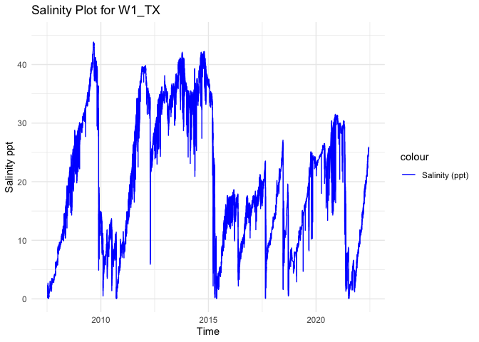<!-- -->

``` r
tempplot <- ggplot(W1_TX, aes(x = datetime)) +
    geom_line(aes(y = temp, color = "Temperature (C)")) +
    ylim(0, 45) +
    labs(x = "Time", y = "Temperature C", title = "Temperature Plot for W1_TX") +
    scale_color_manual(values = c( "Temperature (C)" = "red")) +
    theme_minimal()


tempplot
```

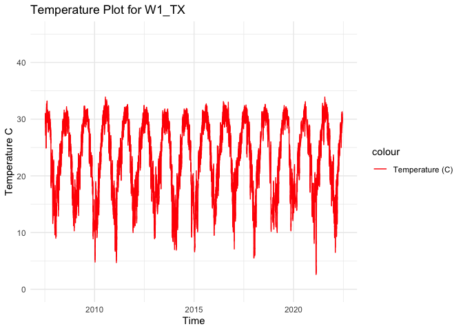<!-- -->

### We need to calculate the mean, maximum, and minimum values for salinity and temperature per month and year. First make two data frames to contain each of the annual and monthly averages.

``` r
#Calculate the mean, maximum, and minimum values for salinity and temperature for each month. 
W1_TX_envrmonth <- W1_TX %>%
    mutate(year = year(datetime), month = month(datetime)) %>%
    group_by(year, month) %>%
    summarise(
      min_salinity = min(salinity),
      max_salinity = max(salinity),
      mean_salinity = mean(salinity),
      length_salinity = length(salinity),
      min_temp = min(temp),
      max_temp = max(temp),
      mean_temp = mean(temp),
      length_temp = length(temp))
```

    ## `summarise()` has grouped output by 'year'. You can override using the `.groups` argument.

``` r
print(W1_TX_envrmonth)
```

    ## # A tibble: 180 × 10
    ## # Groups:   year [16]
    ##     year month min_salinity max_salinity mean_salinity length_salinity min_temp max_temp mean_temp length_temp
    ##    <dbl> <dbl>        <dbl>        <dbl>         <dbl>           <int>    <dbl>    <dbl>     <dbl>       <int>
    ##  1  2007     7          0.1          2.7          1.08            1978     24.9     31.2      28.8        1978
    ##  2  2007     8          0.2          3            1.49            2975     28.5     33.2      30.6        2975
    ##  3  2007     9          1.3          3.5          2.49            2710     27.7     31.4      29.4        2710
    ##  4  2007    10          2.8          3.8          3.16            2841     17.9     30        25.4        2841
    ##  5  2007    11          3.6          6.3          4.40            2879     11.6     24.6      19.8        2879
    ##  6  2007    12          5.3          6.7          6.06            2975     13       22.8      16.6        2975
    ##  7  2008     1          6.5          9.6          8.37            2975      9       18.3      13.0        2975
    ##  8  2008     2          8.5         10.2          9.39            2784     12.9     21.7      17.8        2784
    ##  9  2008     3          9.6         12.4         10.8             2972     12.9     24.2      19.0        2972
    ## 10  2008     4          9.9         14.6         12.9             2879     20.1     26.1      23.3        2879
    ## # ℹ 170 more rows

``` r
#Calculate the mean, maximum, and minimum values for salinity and temperature for each year. 
W1_TX_envryear <- W1_TX %>%
    mutate(year = year(datetime)) %>%
    group_by(year) %>%
    summarise(
      min_salinity = min(salinity),
      max_salinity = max(salinity),
      mean_salinity = mean(salinity),
      min_temp = min(temp),
      max_temp = max(temp),
      mean_temp = mean(temp))

print(W1_TX_envryear)
```

    ## # A tibble: 16 × 7
    ##     year min_salinity max_salinity mean_salinity min_temp max_temp mean_temp
    ##    <dbl>        <dbl>        <dbl>         <dbl>    <dbl>    <dbl>     <dbl>
    ##  1  2007          0.1          6.7          3.24     11.6     33.2      24.8
    ##  2  2008          6.5         29.5         18.2       9       32.2      22.6
    ##  3  2009          4.9         43.8         32.8       8.9     32.3      22.9
    ##  4  2010          0.1         14.8          7.92      4.8     33.9      22.7
    ##  5  2011          7           39.6         24.3       4.7     32.6      23.1
    ##  6  2012          5.9         39.8         32.2      10.5     32.4      23.9
    ##  7  2013         27.9         42.1         36.3       8.4     31.8      22.6
    ##  8  2014         20.9         42.2         36.4       6.9     31.9      22.0
    ##  9  2015          0.1         37.5         14.5       6.6     32.7      23.4
    ## 10  2016          2.2         18.6         13.5       9.5     33.1      24.0
    ## 11  2017          0.1         23.5         15.3       7.1     32.5      24.3
    ## 12  2018          0.5         27.1         14.4       5.5     32.6      22.8
    ## 13  2019          2.9         25.1         17.0      10       32.4      22.9
    ## 14  2020         13.4         31.5         26.2      11.8     33.1      23.4
    ## 15  2021          0.1         30.8         13.7       2.6     33.9      23.4
    ## 16  2022          8.9         25.9         16.7       6.5     31.3      20.2

``` r
#Calculate the mean, maximum, and minimum values for salinity and temperature for each day. 
W1_TX_envrday <- W1_TX %>%
    mutate(year = year(datetime), month = month(datetime), day = day(datetime)) %>%
    group_by(year, month, day) %>%
    summarise(
      min_salinity = min(salinity),
      max_salinity = max(salinity),
      mean_salinity = mean(salinity),
      length_salinity = length(salinity),
      min_temp = min(temp),
      max_temp = max(temp),
      mean_temp = mean(temp),
      length_temp = length(temp))
```

    ## `summarise()` has grouped output by 'year', 'month'. You can override using the `.groups` argument.

``` r
print(W1_TX_envrday)
```

    ## # A tibble: 5,148 × 11
    ## # Groups:   year, month [180]
    ##     year month   day min_salinity max_salinity mean_salinity length_salinity min_temp max_temp mean_temp length_temp
    ##    <dbl> <dbl> <int>        <dbl>        <dbl>         <dbl>           <int>    <dbl>    <dbl>     <dbl>       <int>
    ##  1  2007     7    11          0.2          0.5         0.367              58     29.3     31        30.3          58
    ##  2  2007     7    12          0.3          0.4         0.345              96     29.2     30.9      30.1          96
    ##  3  2007     7    13          0.3          0.6         0.389              96     29.6     31        30.3          96
    ##  4  2007     7    14          0.5          0.9         0.675              96     29.3     30.4      29.8          96
    ##  5  2007     7    15          0.6          1.6         0.979              96     29.2     30.2      29.6          96
    ##  6  2007     7    16          0.8          2.3         1.51               96     28.6     29.3      29.1          96
    ##  7  2007     7    17          1.7          2.3         2.01               96     28.4     29.3      28.8          96
    ##  8  2007     7    18          1.3          2           1.78               96     27.7     28.5      28.0          96
    ##  9  2007     7    19          1.3          2.7         2.19               96     27.1     28.2      27.6          96
    ## 10  2007     7    20          1.7          2.1         1.84               96     27.4     27.7      27.6          96
    ## # ℹ 5,138 more rows

### Plot the months and years of data collection to check if there are any collection gaps in the data.

``` r
timeplot <- ggplot(W1_TX_envrmonth, aes(x = year)) +
    geom_point(aes(y = month, color = length_salinity), size = 4) +
    labs(x = "Time", y = "Month", title = "Timeplot for W1_TX") +
    ylim(1,12) +
    theme_minimal()

timeplot
```

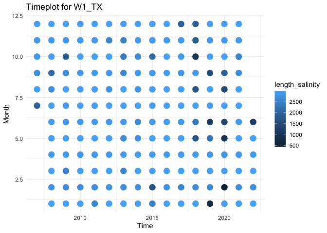<!-- -->

# Calculate days above and below thresholds and plot

``` r
# open up a blank data frame that spans all 12 months for all years of data collection for this site
# we will merge this with the observations so that we can plot over time 

complete_year_month <- expand.grid(
  year = unique(firstyear:finalyear),
  month = 1:12
)
```

# start with low salinity stress

``` r
# first calculate for low salinity
W1_TX$low_sal_stress <- W1_TX$salinity < 12

low_sal_stress_count <- W1_TX %>%
  mutate(year = year(datetime), 
         month = month(datetime), 
         day = day(datetime)) %>% 
  filter(low_sal_stress == 1) %>%  
  distinct(year, month, day) %>%  # remove dups
  group_by(year, month) %>%
  summarise(low_sal_stress = n(), .groups = "drop") # group all occurrences together by month rather than by numeric day

print(low_sal_stress_count)
```

    ## # A tibble: 77 × 3
    ##     year month low_sal_stress
    ##    <dbl> <dbl>          <int>
    ##  1  2007     7             21
    ##  2  2007     8             31
    ##  3  2007     9             29
    ##  4  2007    10             30
    ##  5  2007    11             30
    ##  6  2007    12             31
    ##  7  2008     1             31
    ##  8  2008     2             29
    ##  9  2008     3             31
    ## 10  2008     4              9
    ## # ℹ 67 more rows

``` r
# this plots low sal stress days only, years with no observations of low salinity stress will not appear in the graph 
ggplot(low_sal_stress_count, aes(x = factor(month), y = low_sal_stress, fill = factor(month))) +
  geom_bar(stat = "identity", fill = "#1f77b4") +
  facet_wrap(~ year) +
  labs(title = "W1_TX: count of low salinity (< 12 ppt) days per month",
       x = "month",
       y = "count of days") +
  theme_minimal()
```

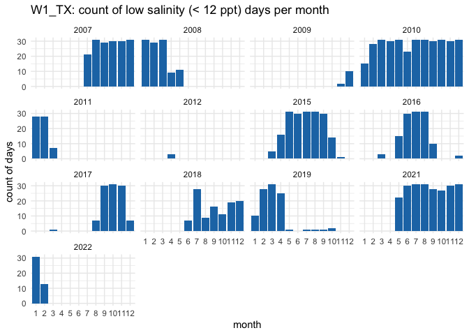<!-- -->

``` r
# Merge with the original dataset, filling missing values with 0 for low_sal_stress
low_sal_complete_data <- complete_year_month %>%
  left_join(low_sal_stress_count, by = c("year", "month")) %>%
  mutate(low_sal_stress = ifelse(is.na(low_sal_stress), 0, low_sal_stress))

low_sal_complete_data$month <- as.numeric(low_sal_complete_data$month)

# bars
ggplot(low_sal_complete_data, aes(x = factor(month), y = low_sal_stress)) +
  geom_bar(stat = "identity", fill = "#1f77b4") + 
  facet_wrap(~ year) +
  labs(title = "W1_TX: count of low salinity (< 12 ppt) days per month",
       x = "month",
       y = "count of low salinity stress days") +
  theme_minimal()
```

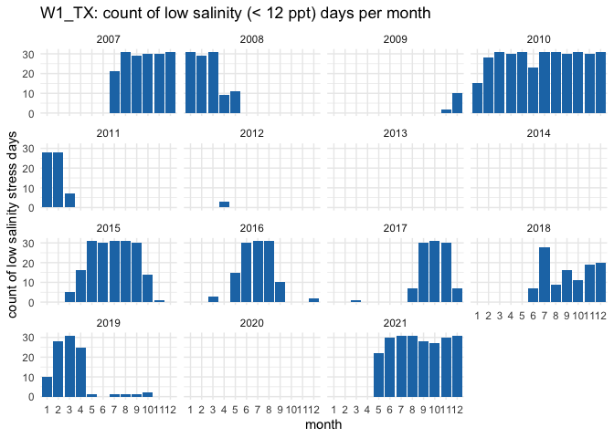<!-- -->

``` r
# points
ggplot(low_sal_complete_data, aes(x = factor(month), y = low_sal_stress)) +
  geom_point(color = "#1f77b4", size = 2) + 
  facet_wrap(~ year) +  
  labs(title = "W1_TX: count of low salinity (< 12 ppt) days per month",
       x = "month",
       y = "count of low salinity stress days") +
  theme_minimal()
```

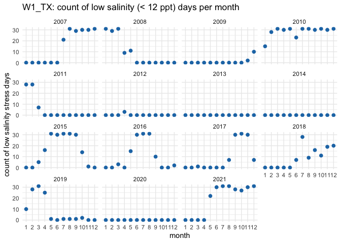<!-- -->

# now calculate for high salinity stress

``` r
W1_TX$high_sal_stress <- W1_TX$salinity > 35

high_sal_stress_count <- W1_TX %>%
  mutate(year = year(datetime), 
         month = month(datetime), 
         day = day(datetime)) %>% 
  filter(high_sal_stress == 1) %>%  
  distinct(year, month, day) %>%  # remove dups
  group_by(year, month) %>%
  summarise(high_sal_stress = n(), .groups = "drop") # group all occurrences together by month rather than by numeric day

print(high_sal_stress_count)
```

    ## # A tibble: 40 × 3
    ##     year month high_sal_stress
    ##    <dbl> <dbl>           <int>
    ##  1  2009     5               6
    ##  2  2009     6              26
    ##  3  2009     7              31
    ##  4  2009     8              31
    ##  5  2009     9              29
    ##  6  2009    10              20
    ##  7  2009    11              15
    ##  8  2011    10              27
    ##  9  2011    11              30
    ## 10  2011    12              31
    ## # ℹ 30 more rows

``` r
ggplot(high_sal_stress_count, aes(x = factor(month), y = high_sal_stress, fill = factor(month))) +
  geom_bar(stat = "identity", fill = "#1B9AAA") +
  facet_wrap(~ year) +
  labs(title = "W1_TX: count of high salinity (> 35 ppt) days per month",
       x = "month",
       y = "count of days") +
  theme_minimal()
```

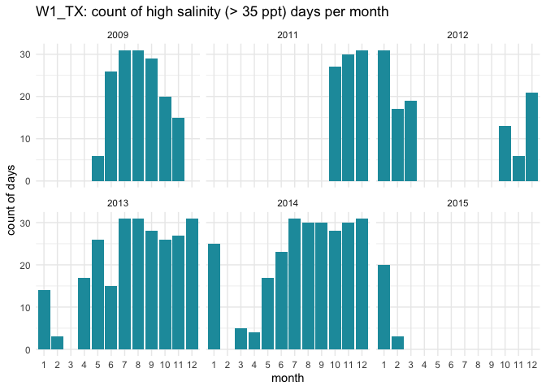<!-- -->

``` r
high_sal_complete_data <- complete_year_month %>%
  left_join(high_sal_stress_count, by = c("year", "month")) %>%
  mutate(high_sal_stress = ifelse(is.na(high_sal_stress), 0, high_sal_stress))

high_sal_complete_data$month <- as.numeric(high_sal_complete_data$month)

# bars
ggplot(high_sal_complete_data, aes(x = factor(month), y = high_sal_stress)) +
  geom_bar(stat = "identity", fill = "#1B9AAA") + 
  facet_wrap(~ year) +
  labs(title = "W1_TX: count of high salinity (> 35 ppt) days per month",
       x = "month",
       y = "count of days") +
  theme_minimal()
```

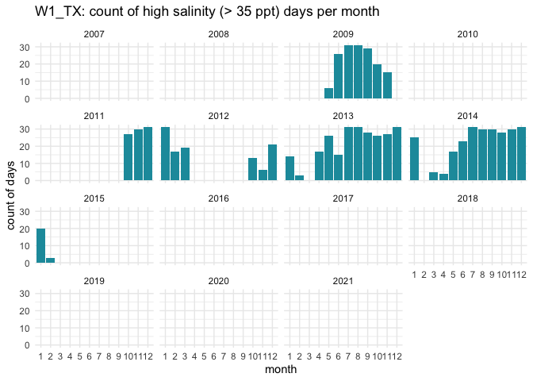<!-- -->

``` r
# points
ggplot(high_sal_complete_data, aes(x = factor(month), y = high_sal_stress)) +
  geom_point(color = "#1B9AAA", size = 2) + 
  facet_wrap(~ year) +  
  labs(title = "W1_TX: count of high salinity (> 35 ppt) days per month",
       x = "month",
       y = "count of days") +
  theme_minimal()
```

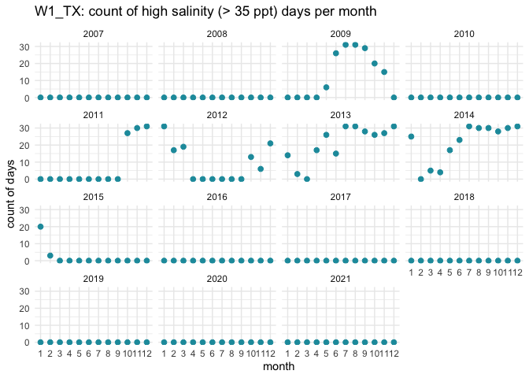<!-- -->

``` r
ggplot() +
  geom_bar(data = low_sal_complete_data, aes(x = factor(month), y = low_sal_stress), 
           stat = "identity", fill = "#1f77b4") +
  geom_bar(data = high_sal_complete_data, aes(x = factor(month), y = high_sal_stress), 
           stat = "identity", fill = "#1B9AAA") + 
  facet_wrap(~ year) +
  labs(title = "W1_TX: count of stressful salinity days per month", 
       x = "month", 
       y = "count of days") + 
  theme_minimal()
```

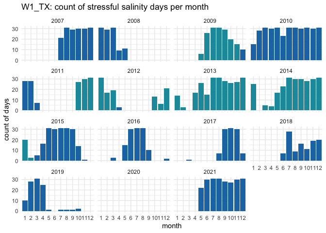<!-- -->

``` r
ggplot() +
  geom_point(data = low_sal_complete_data, aes(x = factor(month), y = low_sal_stress), 
           color = "#1f77b4", size = 2) +
  geom_point(data = high_sal_complete_data, aes(x = factor(month), y = high_sal_stress), 
           color = "#1B9AAA", size = 2) + 
  facet_wrap(~ year) +
  labs(title = "W1_TX: count of stressful salinity days per month", 
       x = "month", 
       y = "count of days") + 
  theme_minimal()
```

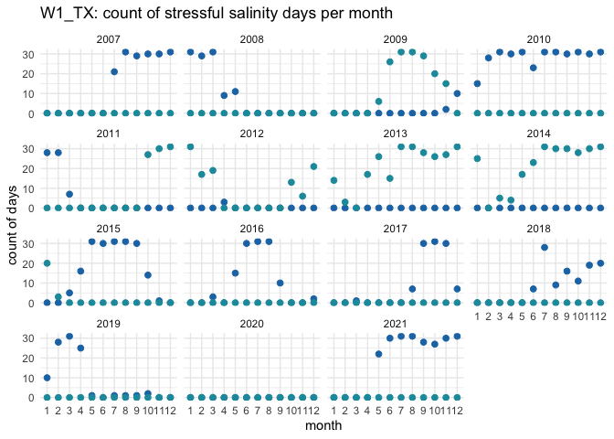<!-- -->

# high temp stress calculations

``` r
W1_TX$high_temp_stress <- W1_TX$temp > 28

high_temp_stress_count <- W1_TX %>%
  mutate(year = year(datetime), 
         month = month(datetime), 
         day = day(datetime)) %>% 
  filter(high_temp_stress == 1) %>%  
  distinct(year, month, day) %>%  # remove dups
  group_by(year, month) %>%
  summarise(high_temp_stress = n(), .groups = "drop") # group all occurrences together by month rather than by numeric day

print(high_temp_stress_count)
```

    ## # A tibble: 87 × 3
    ##     year month high_temp_stress
    ##    <dbl> <dbl>            <int>
    ##  1  2007     7               19
    ##  2  2007     8               31
    ##  3  2007     9               29
    ##  4  2007    10               15
    ##  5  2008     5               10
    ##  6  2008     6               30
    ##  7  2008     7               29
    ##  8  2008     8               29
    ##  9  2008     9                6
    ## 10  2009     5               10
    ## # ℹ 77 more rows

``` r
ggplot(high_temp_stress_count, aes(x = factor(month), y = high_temp_stress, fill = factor(month))) +
  geom_bar(stat = "identity", fill = "#DD4124FF") +
  facet_wrap(~ year) +
  labs(title = "W1_TX: count of high temperature (> 28 C) days per month",
       x = "month",
       y = "count of days") +
  theme_minimal()
```

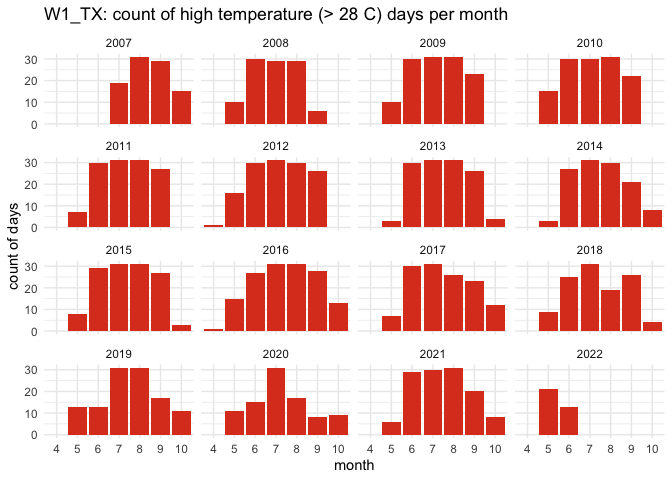<!-- -->

``` r
high_temp_complete_data <- complete_year_month %>%
  left_join(high_temp_stress_count, by = c("year", "month")) %>%
  mutate(high_temp_stress = ifelse(is.na(high_temp_stress), 0, high_temp_stress))

high_temp_complete_data$month <- as.numeric(high_temp_complete_data$month)

# bars
ggplot(high_temp_complete_data, aes(x = factor(month), y = high_temp_stress)) +
  geom_bar(stat = "identity", fill = "#DD4124FF") + 
  facet_wrap(~ year) +
  labs(title = "W1_TX: count of high temperature (> 28 C) days per month",
       x = "month",
       y = "count of days") +
  theme_minimal()
```

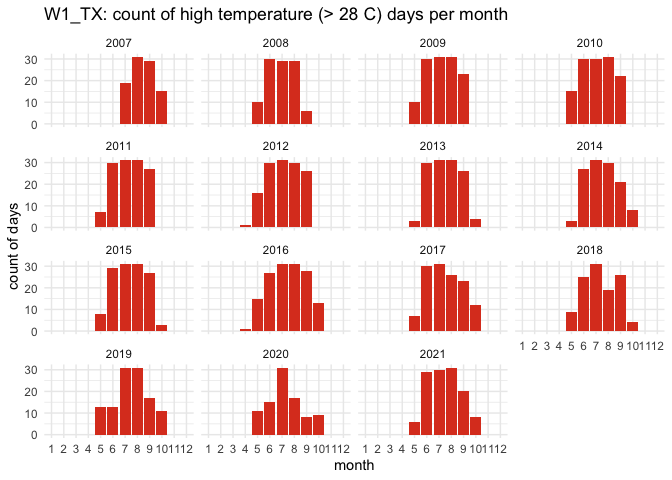<!-- -->

``` r
# points
ggplot(high_temp_complete_data, aes(x = factor(month), y = high_temp_stress)) +
  geom_point(color = "#DD4124FF", size = 2) + 
  facet_wrap(~ year) +  
  labs(title = "W1_TX: count of high temperature (> 28 C) days per month",
       x = "month",
       y = "count of days") +
  theme_minimal()
```

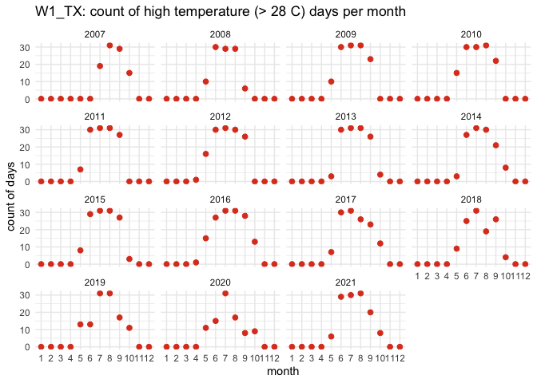<!-- -->

### We can now calculate a list of variables that we will have collected for all sites. This will allow us to compare sites easily. We will calculate the number of observations from each site, the mean annual, maximum annual, and minimum annual value for all variables.

Our list of variables includes:

- Mean_Annual_Temperature_C: average of all available data

- Mean_max_temperature_C: average of maximums for each year

- Mean_min_temperature_C: average of minimums for each year

- Temperature_st_dev: standard deviation of all available data

- Temperature_n: total number of data points

- Temperature_years: number of years in data set

- Mean_Annual_Salinity_ppt: average of all available data

- Mean_min_Salinity_ppt: average of minimums for each year

- Mean_max_Salinity_ppt: average of maximums for each year

- Salinity_st_dev: standard deviation of all available data

- Salinity_n: total number of data points

- Salinity_years: number of years in data set

``` r
#Calculate temperature variables. 
Mean_Annual_Temperature_C <- mean(W1_TX$temp)
Mean_max_temperature_C <- mean(W1_TX_envryear$max_temp)
Mean_min_temperature_C <- mean(W1_TX_envryear$min_temp)
Temperature_st_dev <- sd(W1_TX$temp)
Temperature_n <- nrow(W1_TX)
Temperature_years <- nrow(W1_TX_envryear)
high_temp_stress_days <- sum(high_temp_stress_count$high_temp_stress)
frac_high_temp_stress_days <- high_temp_stress_days/nrow(W1_TX_envrday)

Mean_Monthly_Temperature_C <- W1_TX_envrmonth %>%
  filter(!is.na(month)) %>% 
  group_by(month) %>%
  summarise(Mean_Temperature = mean(mean_temp))

Mean_min_Monthly_Temperature_C <- W1_TX_envrmonth %>%
  filter(!is.na(month)) %>% 
  group_by(month) %>%
  summarise(Mean_min_Temperature = mean(min_temp))

Mean_max_Monthly_Temperature_C <- W1_TX_envrmonth %>%
  filter(!is.na(month)) %>% 
  group_by(month) %>%
  summarise(Mean_max_Temperature = mean(max_temp))

#Create a data frame to store the temperature results
W1_TX_temp <- cbind(site_name, download_date, source_description, lat, lon, firstyear, finalyear, Mean_Annual_Temperature_C, Mean_max_temperature_C, Mean_min_temperature_C, Temperature_st_dev, high_temp_stress_days, frac_high_temp_stress_days, Temperature_n, Temperature_years, collection_type)
print(W1_TX_temp)
```

    ##      site_name download_date source_description                                                 lat       lon       
    ## [1,] "W1_TX"   "07-07-2023"  "NERR Centralized Data. Mission Aransas - Copano Bay West MARCWWQ" "28.0841" "-97.2009"
    ##      firstyear finalyear Mean_Annual_Temperature_C Mean_max_temperature_C Mean_min_temperature_C Temperature_st_dev
    ## [1,] "2007"    "2021"    "23.1060500319357"        "32.61875"             "7.775"                "6.38548669115223"
    ##      high_temp_stress_days frac_high_temp_stress_days Temperature_n Temperature_years collection_type
    ## [1,] "1839"                "0.357226107226107"        "490047"      "16"              "continuous"

``` r
W1_TX_monthly_temp <- cbind(Mean_Monthly_Temperature_C, Mean_min_Monthly_Temperature_C, Mean_max_Monthly_Temperature_C)
W1_TX_monthly_temp <- W1_TX_monthly_temp[, !duplicated(names(W1_TX_monthly_temp))]
print(W1_TX_monthly_temp)
```

    ##    month Mean_Temperature Mean_min_Temperature Mean_max_Temperature
    ## 1      1         13.65133              8.62000             19.12000
    ## 2      2         15.76017             10.42000             20.66667
    ## 3      3         19.58995             14.13333             24.18000
    ## 4      4         23.15847             19.20000             26.59333
    ## 5      5         26.58350             22.90667             29.60000
    ## 6      6         29.51270             27.19333             31.71333
    ## 7      7         30.05491             27.64000             32.31333
    ## 8      8         30.51484             28.43333             32.46000
    ## 9      9         28.59859             25.30000             31.47333
    ## 10    10         24.96058             19.18000             28.97333
    ## 11    11         19.62657             13.86667             24.82667
    ## 12    12         15.50599             11.20000             20.22000

``` r
# Write to the combined file with all sites 
write.table(W1_TX_temp, "/Users/madelineeppley/GitHub/MVP-H2F-HatcheryField/data/environment/all_temperature.csv", sep = ",", append = TRUE, col.names = FALSE, row.names = FALSE) # The column names should be changed to FALSE after 1st row is added to the data frame

# Write to a unique new CSV file
write.csv(W1_TX_temp, "/Users/madelineeppley/GitHub/MVP-H2F-HatcheryField/data/environment/W1_TX_temperature.csv")

# Write all montly data to a unique new CSV file
write.csv(W1_TX_monthly_temp, "/Users/madelineeppley/GitHub/MVP-H2F-HatcheryField/data/environment/W1_TX_monthly_temp.csv")
```

``` r
#Calculate the salinity variables
Mean_Annual_Salinity_ppt <- mean(W1_TX$salinity)
Mean_max_Salinity_ppt <- mean(W1_TX_envryear$max_salinity)
Mean_min_Salinity_ppt <- mean(W1_TX_envryear$min_salinity)
Salinity_st_dev <- sd(W1_TX$salinity)
Salinity_n <- nrow(W1_TX)
Salinity_years <- nrow(W1_TX_envryear)
high_sal_stress_days <- sum(high_sal_stress_count$high_sal_stress)
low_sal_stress_days <- sum(low_sal_stress_count$low_sal_stress)
frac_high_sal_stress_days <- high_sal_stress_days/nrow(W1_TX_envrday)
frac_low_sal_stress_days <- low_sal_stress_days/nrow(W1_TX_envrday)

Mean_Monthly_Salinity <- W1_TX_envrmonth %>%
  filter(!is.na(month)) %>%
  group_by(month) %>%
  summarise(Mean_Salinity = mean(mean_salinity))

Min_Monthly_Salinity <- W1_TX_envrmonth %>%
  filter(!is.na(month)) %>%
  group_by(month) %>%
  summarise(Min_Salinity = mean(min_salinity))

Max_Monthly_Salinity <- W1_TX_envrmonth %>%
  filter(!is.na(month)) %>%
  group_by(month) %>%
  summarise(Max_Salinity = mean(max_salinity))

#Create a data frame to store the temperature results
W1_TX_salinity <- cbind(site_name, download_date, source_description, lat, lon, firstyear, finalyear, Mean_Annual_Salinity_ppt, Mean_max_Salinity_ppt, Mean_min_Salinity_ppt, high_sal_stress_days,low_sal_stress_days, frac_high_sal_stress_days, frac_low_sal_stress_days, Salinity_st_dev, Salinity_n, Salinity_years, collection_type)
print(W1_TX_salinity)
```

    ##      site_name download_date source_description                                                 lat       lon       
    ## [1,] "W1_TX"   "07-07-2023"  "NERR Centralized Data. Mission Aransas - Copano Bay West MARCWWQ" "28.0841" "-97.2009"
    ##      firstyear finalyear Mean_Annual_Salinity_ppt Mean_max_Salinity_ppt Mean_min_Salinity_ppt high_sal_stress_days
    ## [1,] "2007"    "2021"    "20.8577879264642"       "29.90625"            "6.34375"             "879"               
    ##      low_sal_stress_days frac_high_sal_stress_days frac_low_sal_stress_days Salinity_st_dev    Salinity_n Salinity_years
    ## [1,] "1604"              "0.170745920745921"       "0.311577311577312"      "11.6641309381336" "490047"   "16"          
    ##      collection_type
    ## [1,] "continuous"

``` r
W1_TX_monthly_sal <- cbind(Mean_Monthly_Salinity, Min_Monthly_Salinity, Max_Monthly_Salinity)
W1_TX_monthly_sal <- W1_TX_monthly_sal[, !duplicated(names(W1_TX_monthly_sal))]
print(W1_TX_monthly_sal)
```

    ##    month Mean_Salinity Min_Salinity Max_Salinity
    ## 1      1      21.40209     18.34000     22.62000
    ## 2      2      21.03206     17.35333     22.84667
    ## 3      3      21.35931     16.71333     23.30667
    ## 4      4      21.28343     15.78667     23.76000
    ## 5      5      20.32961     15.10000     23.82667
    ## 6      6      20.29978     15.38000     22.34667
    ## 7      7      18.89031     14.66667     21.34667
    ## 8      8      20.41999     14.90667     22.65333
    ## 9      9      21.07029     14.10667     23.66667
    ## 10    10      21.40586     15.56000     23.22667
    ## 11    11      21.45394     15.62667     23.94000
    ## 12    12      21.03029     18.20000     22.48667

``` r
# Write to the combined file with all sites 
write.table(W1_TX_salinity, "/Users/madelineeppley/GitHub/MVP-H2F-HatcheryField/data/environment/all_salinity.csv", sep = ",", append = TRUE, col.names = FALSE, row.names = FALSE) # The column names should be changed to FALSE after 1st row is added to the data frame

# Write all year data to a unique new CSV file
write.csv(W1_TX_salinity, "/Users/madelineeppley/GitHub/MVP-H2F-HatcheryField/data/environment/W1_TX_salinity.csv")
# Write all montly data to a unique new CSV file
write.csv(W1_TX_monthly_sal, "/Users/madelineeppley/GitHub/MVP-H2F-HatcheryField/data/environment/W1_TX_monthly_sal.csv")
```
