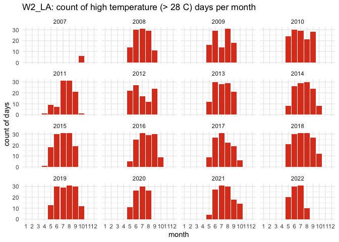

W2_LA - Processed Environmental Data
================
Madeline Eppley
8/15/2023

``` r
setwd("/Users/madelineeppley/GitHub/MVP-H2F-HatcheryField/data/environment")
```

### Install required packaages

``` r
#install.packages("dataRetrieval")
```

### Load required packages.

``` r
library("dplyr") #Used for working with data frames
library("lubridate") #Used for time-date conversions
library("readr") #Used to read the CSV file
library("ggplot2") 
library("dataRetrieval") #Used to download USGS data
library("tidyverse") #Used to join data frames
```

### Note the date of data download and source. All available data should be used for each site regardless of year. Note from the CSV file how often the site was sampled, and if there are replicates in the data. Also describe if the sampling occurred at only low tide, only high tide, or continuously.

``` r
#Data was downloaded on 8/15/2023
#Source - https://waterdata.usgs.gov/monitoring-location/07381349/#parameterCode=00065&period=P7D - Caillou Lake (Sister Lake) SW of Dulac, LA - Site Number 07381349

#Create text strings with metadata information that we want to include in the final data frame. 
download_date <- ("08-15-2023")
source_description <- ("USGS Water Data Sister Lake - 07381349")
site_name <- ("W2_LA") #Use site code with site number based on lat position and state
collection_type <- ("continuous")
```

### Read in the data using the USGS Data Retrieval Package in R. This will skip the step of downloading a .csv file or similar and importing that file from the desktop. We will import the salinity and temperature data separately and store them with “\_sal” or “\_temp” in the variable names. Then we will combine them into one file together.

``` r
siteNumber <- "07381349" # USGS Site Code

# Import our site info and read the associated metdata.
W2_LAInfo <- readNWISsite(siteNumber)
comment(W2_LAInfo)
```

    ##  [1] "#"                                                                                        
    ##  [2] "#"                                                                                        
    ##  [3] "# US Geological Survey"                                                                   
    ##  [4] "# retrieved: 2025-02-21 14:00:02 -05:00\t(caas01)"                                        
    ##  [5] "#"                                                                                        
    ##  [6] "# The Site File stores location and general information about groundwater,"               
    ##  [7] "# surface water, and meteorological sites"                                                
    ##  [8] "# for sites in USA."                                                                      
    ##  [9] "#"                                                                                        
    ## [10] "# File-format description:  http://help.waterdata.usgs.gov/faq/about-tab-delimited-output"
    ## [11] "# Automated-retrieval info: http://waterservices.usgs.gov/rest/Site-Service.html"         
    ## [12] "#"                                                                                        
    ## [13] "# Contact:   gs-w_support_nwisweb@usgs.gov"                                               
    ## [14] "#"                                                                                        
    ## [15] "# The following selected fields are included in this output:"                             
    ## [16] "#"                                                                                        
    ## [17] "#  agency_cd       -- Agency"                                                             
    ## [18] "#  site_no         -- Site identification number"                                         
    ## [19] "#  station_nm      -- Site name"                                                          
    ## [20] "#  site_tp_cd      -- Site type"                                                          
    ## [21] "#  lat_va          -- DMS latitude"                                                       
    ## [22] "#  long_va         -- DMS longitude"                                                      
    ## [23] "#  dec_lat_va      -- Decimal latitude"                                                   
    ## [24] "#  dec_long_va     -- Decimal longitude"                                                  
    ## [25] "#  coord_meth_cd   -- Latitude-longitude method"                                          
    ## [26] "#  coord_acy_cd    -- Latitude-longitude accuracy"                                        
    ## [27] "#  coord_datum_cd  -- Latitude-longitude datum"                                           
    ## [28] "#  dec_coord_datum_cd -- Decimal Latitude-longitude datum"                                
    ## [29] "#  district_cd     -- District code"                                                      
    ## [30] "#  state_cd        -- State code"                                                         
    ## [31] "#  county_cd       -- County code"                                                        
    ## [32] "#  country_cd      -- Country code"                                                       
    ## [33] "#  land_net_ds     -- Land net location description"                                      
    ## [34] "#  map_nm          -- Name of location map"                                               
    ## [35] "#  map_scale_fc    -- Scale of location map"                                              
    ## [36] "#  alt_va          -- Altitude of Gage/land surface"                                      
    ## [37] "#  alt_meth_cd     -- Method altitude determined"                                         
    ## [38] "#  alt_acy_va      -- Altitude accuracy"                                                  
    ## [39] "#  alt_datum_cd    -- Altitude datum"                                                     
    ## [40] "#  huc_cd          -- Hydrologic unit code"                                               
    ## [41] "#  basin_cd        -- Drainage basin code"                                                
    ## [42] "#  topo_cd         -- Topographic setting code"                                           
    ## [43] "#  instruments_cd  -- Flags for instruments at site"                                      
    ## [44] "#  construction_dt -- Date of first construction"                                         
    ## [45] "#  inventory_dt    -- Date site established or inventoried"                               
    ## [46] "#  drain_area_va   -- Drainage area"                                                      
    ## [47] "#  contrib_drain_area_va -- Contributing drainage area"                                   
    ## [48] "#  tz_cd           -- Time Zone abbreviation"                                             
    ## [49] "#  local_time_fg   -- Site honors Daylight Savings Time"                                  
    ## [50] "#  reliability_cd  -- Data reliability code"                                              
    ## [51] "#  gw_file_cd      -- Data-other GW files"                                                
    ## [52] "#  nat_aqfr_cd     -- National aquifer code"                                              
    ## [53] "#  aqfr_cd         -- Local aquifer code"                                                 
    ## [54] "#  aqfr_type_cd    -- Local aquifer type code"                                            
    ## [55] "#  well_depth_va   -- Well depth"                                                         
    ## [56] "#  hole_depth_va   -- Hole depth"                                                         
    ## [57] "#  depth_src_cd    -- Source of depth data"                                               
    ## [58] "#  project_no      -- Project number"                                                     
    ## [59] "#"

``` r
# Store the parameter codes that we want to collect data for. The USGS codes salinity as 00480 and temperature (C) as 00010. 
parameterCd_sal <- "00480"
parameterCd_temp <- "00010"
 
# We will retrieve the unit values, or the data values collected at regular intervals. Note the regularity of collection, for this site it is every 15 minutes. 
rawUnitValues_sal <- readNWISuv(siteNumber, parameterCd_sal, "2007-10-01", "2022-08-09")
rawUnitValues_temp <- readNWISuv(siteNumber, parameterCd_temp,"2007-10-01", "2022-08-09")

# View how the data is stored. Note the variable names and the format and units that the data are stored in.  
#View(rawUnitValues_sal)
#View(rawUnitValues_temp)
```

### Combine the salinity and temperature data into one common data frame and name it with the appropriate site code using the “raw\_” format. Filter the combined data frame to include no duplicate columns and rename column headers.

``` r
# Join the data frames by common time using the dateTime column
raw_W2_LA <- rawUnitValues_sal %>%
  inner_join(rawUnitValues_temp, by = "dateTime")


# We now have "double" columns for site code, agency, time zone, and other parameters. Remove those columns. 
raw_W2_LA <- subset(raw_W2_LA, select = -c(agency_cd.y, X_00480_00000_cd, site_no.y, X_00010_00000_cd, tz_cd.x, tz_cd.y))

#Standardize column and variable names. We will use "temp" for temperature in degrees C, "salinity" for salinity in parts per thousand (ppt), "lat" for latitude in degrees, and "lon" for longitude in degrees. 
#Use the dyplr format to rename multiple columns in the format "dataframe %>% rename("new name 1" = "old name 1", "new name 2", "old name 2")
raw_W2_LA <- raw_W2_LA %>% rename("temp" = "X_00010_00000", "salinity" = "X_00480_00000", "site" = "site_no.x", "agency" = "agency_cd.x") 
```

### Start with the date and time of collection. We will use the lubridate package to standardize all values into the date-time format called POSIXct. This format stores the date and time in number of seconds since a past point (1/1/1970). This makes comparisons easy and helps to standardizes values.

``` r
# SKIP combining, date and time of collection is already in a column together 

#Convert to POSIXct format. Store it into a column named datetime in the data frame.
raw_W2_LA$datetime <- as.POSIXct(raw_W2_LA$dateTime, "%Y/%m/%d %H:%M:%S", tz = "")

# Drop the old date-time column
raw_W2_LA <- subset(raw_W2_LA, select = -c(dateTime))

#Print the new data frame and examine to make sure the new datetime column is in the correct format. 
summary(raw_W2_LA)
```

    ##     agency              site              salinity          temp          datetime                     
    ##  Length:246950      Length:246950      Min.   : 0.20   Min.   : 2.20   Min.   :2007-10-01 06:00:00.00  
    ##  Class :character   Class :character   1st Qu.: 6.10   1st Qu.:17.40   1st Qu.:2010-08-02 05:37:30.00  
    ##  Mode  :character   Mode  :character   Median :10.00   Median :23.90   Median :2014-09-16 08:45:00.00  
    ##                                        Mean   :10.46   Mean   :22.86   Mean   :2014-11-20 05:40:05.08  
    ##                                        3rd Qu.:15.00   3rd Qu.:29.00   3rd Qu.:2018-09-23 05:52:30.00  
    ##                                        Max.   :31.00   Max.   :34.40   Max.   :2022-08-10 04:30:00.00

``` r
# we have NAs, so remove those
raw_W2_LA <- raw_W2_LA %>%
    filter(!is.na(datetime))
summary(raw_W2_LA$datetime)
```

    ##                       Min.                    1st Qu.                     Median                       Mean 
    ## "2007-10-01 06:00:00.0000" "2010-08-02 05:37:30.0000" "2014-09-16 08:45:00.0000" "2014-11-20 05:40:05.0937" 
    ##                    3rd Qu.                       Max. 
    ## "2018-09-23 05:52:30.0000" "2022-08-10 04:30:00.0000"

### Analyze the ranges of all of our variables of interest - time, salinity, and temperature. Make sure that the latitude and longitude values are consistent for a static collection site. This is a quick check so we can determine how to conduct the next filtering step.

``` r
#Print the range (minimum and maximum) of dates of data collection. 
print(summary(raw_W2_LA$datetime))
```

    ##                       Min.                    1st Qu.                     Median                       Mean 
    ## "2007-10-01 06:00:00.0000" "2010-08-02 05:37:30.0000" "2014-09-16 08:45:00.0000" "2014-11-20 05:40:05.0937" 
    ##                    3rd Qu.                       Max. 
    ## "2018-09-23 05:52:30.0000" "2022-08-10 04:30:00.0000"

``` r
#Print the range (minimum and maximum) of the salinity values. 
print(summary(raw_W2_LA$salinity))
```

    ##    Min. 1st Qu.  Median    Mean 3rd Qu.    Max. 
    ##    0.20    6.10   10.00   10.46   15.00   31.00

``` r
#Print the range (minimum and maximum) of the temperature values.
print(summary(raw_W2_LA$temp))
```

    ##    Min. 1st Qu.  Median    Mean 3rd Qu.    Max. 
    ##    2.20   17.40   23.90   22.86   29.00   34.40

``` r
#Store variables that we will include in the final data frame. Pull metadata from the USGS website link located above or the site description from the comment function above. 
lat <- 29.24916667
lon <- -90.9211111
firstyear <- 2007
finalyear <- 2022
```

### Filter any of the variables that have data points outside of normal range. We will use 0-40 as the accepted range for salinity (ppt) and temperature (C) values. Note, in the summer, salinity values can sometimes exceed 40. Check to see if there are values above 40. In this case, adjust the range or notify someone that the site has particularly high salinity values.

``` r
#Filter the data between the values of 0 and 40 for both salinity and temperature. 
filtered_W2_LA<- raw_W2_LA %>%
    filter(between(salinity, 0, 40) & between(temp, -1, 40))

# Sanity check - print the ranges to ensure values are filtered properly. We can see that the ranges for both are now in the appropriate range.  
print(summary(filtered_W2_LA$salinity))
```

    ##    Min. 1st Qu.  Median    Mean 3rd Qu.    Max. 
    ##    0.20    6.10   10.00   10.46   15.00   31.00

``` r
print(summary(filtered_W2_LA$temp))
```

    ##    Min. 1st Qu.  Median    Mean 3rd Qu.    Max. 
    ##    2.20   17.40   23.90   22.86   29.00   34.40

``` r
#Store our data into a variable name with just the site name. 
W2_LA <- filtered_W2_LA
```

### Write the final processed data frame to a .csv file to create a reproducible “raw” file

``` r
write.table(W2_LA, "/Users/madelineeppley/GitHub/EasternOysterEnvData/2022_SiteEnvironmentData/W2_LA_raw.csv", sep = ",", append = TRUE, col.names = TRUE, row.names = FALSE) # The column names should be changed to FALSE after 1st row is added to the data frame
```

    ## Warning in write.table(W2_LA, "/Users/madelineeppley/GitHub/EasternOysterEnvData/2022_SiteEnvironmentData/W2_LA_raw.csv", :
    ## appending column names to file

### Visualize the salinity, temperature, and date ranges over time. This can help us see if there are any anomalies or gaps in the data and make sure the filtering was done correctly. Sanity check - do the temperature and salinity ranges look appropriate for the geography of the site (ex. near full ocean salinity for coastal sites, lower salinity for estuaries or near rivers)?

``` r
salplot <- ggplot(W2_LA, aes(x = datetime)) +
    geom_line(aes(y = salinity, color = "Salinity (ppt)")) +
    ylim(0,45) +
    labs(x = "Time", y = "Salinity ppt", title = "Salinity Plot for W2_LA") +
    scale_color_manual(values = c("Salinity (ppt)" = "blue")) +
    theme_minimal()


salplot
```

<!-- -->

``` r
tempplot <- ggplot(W2_LA, aes(x = datetime)) +
    geom_line(aes(y = temp, color = "Temperature (C)")) +
    ylim(-10, 45) +
    labs(x = "Time", y = "Temperature C", title = "Temperature Plot for W2_LA") +
    scale_color_manual(values = c( "Temperature (C)" = "red")) +
    theme_minimal()


tempplot
```

<!-- -->

### We need to calculate the mean, maximum, and minimum values for salinity and temperature per month and year. First make two data frames to contain each of the annual and monthly averages.

``` r
#Calculate the mean, maximum, and minimum values for salinity and temperature for each month. 
W2_LA_envrmonth <- W2_LA %>%
    mutate(year = year(datetime), month = month(datetime)) %>%
    group_by(year, month) %>%
    summarise(
      min_salinity = min(salinity),
      max_salinity = max(salinity),
      mean_salinity = mean(salinity),
      length_salinity = length(salinity),
      min_temp = min(temp),
      max_temp = max(temp),
      mean_temp = mean(temp),
      length_temp = length(temp))
```

    ## `summarise()` has grouped output by 'year'. You can override using the `.groups` argument.

``` r
print(W2_LA_envrmonth)
```

    ## # A tibble: 178 × 10
    ## # Groups:   year [16]
    ##     year month min_salinity max_salinity mean_salinity length_salinity min_temp max_temp mean_temp length_temp
    ##    <dbl> <dbl>        <dbl>        <dbl>         <dbl>           <int>    <dbl>    <dbl>     <dbl>       <int>
    ##  1  2007    10          8.1           25         16.5              570     15.7     28.8      23.6         570
    ##  2  2007    11         10             24         15.6              719     13.2     23.2      19.0         719
    ##  3  2007    12          7.2           20         15.8              461     11       23.8      18.0         461
    ##  4  2008     1          2.8           18         12.3              498      6.9     18.4      12.2         498
    ##  5  2008     2          1.2           23         11.6              696     11.4     21.9      17.2         696
    ##  6  2008     3          2.8           26         10.5              739     11.2     24.6      18.6         739
    ##  7  2008     4          2.2           21         11.3              715     16       27.8      23.4         715
    ##  8  2008     5          0.6           13          5.02             744     22.1     31        26.4         744
    ##  9  2008     6          1             12          4.90             720     28.1     32.2      30.0         720
    ## 10  2008     7          0.6           12          5.03             744     28.2     32.8      30.5         744
    ## # ℹ 168 more rows

``` r
#Calculate the mean, maximum, and minimum values for salinity and temperature for each year. 
W2_LA_envryear <- W2_LA %>%
    mutate(year = year(datetime)) %>%
    group_by(year) %>%
    summarise(
      min_salinity = min(salinity),
      max_salinity = max(salinity),
      mean_salinity = mean(salinity),
      min_temp = min(temp),
      max_temp = max(temp),
      mean_temp = mean(temp))

print(W2_LA_envryear)
```

    ## # A tibble: 16 × 7
    ##     year min_salinity max_salinity mean_salinity min_temp max_temp mean_temp
    ##    <dbl>        <dbl>        <dbl>         <dbl>    <dbl>    <dbl>     <dbl>
    ##  1  2007          7.2           25         16.0      11       28.8      20.2
    ##  2  2008          0.5           26         12.2       6.9     32.8      22.9
    ##  3  2009          0.5           25         10.4       9.3     34.1      22.8
    ##  4  2010          0.3           23          8.83      2.2     34.4      21.6
    ##  5  2011          0.6           30         13.3       4.7     33.5      23.3
    ##  6  2012          1.5           27         13.5       9.2     33.4      22.8
    ##  7  2013          0.7           27         11.6       8.8     32.6      22.8
    ##  8  2014          0.6           31         12.1       3.9     33.8      22.1
    ##  9  2015          0.3           25         10.1      10.4     33.6      24.9
    ## 10  2016          0.3           24          9.43      8.6     33.8      23.0
    ## 11  2017          0.4           25         11.4       5.6     33.1      23.5
    ## 12  2018          0.3           24          9.28      3.8     33.2      23.6
    ## 13  2019          0.2           24          6.94      9.7     33.2      22.8
    ## 14  2020          0.2           25          8.72     10.2     33.1      22.6
    ## 15  2021          0.4           24         10.0       5.7     33.8      22.8
    ## 16  2022          1.5           27         10.6       7       33.5      22.6

``` r
#Calculate the mean, maximum, and minimum values for salinity and temperature for each day. 
W2_LA_envrday <- W2_LA %>%
    mutate(year = year(datetime), month = month(datetime), day = day(datetime)) %>%
    group_by(year, month, day) %>%
    summarise(
      min_salinity = min(salinity),
      max_salinity = max(salinity),
      mean_salinity = mean(salinity),
      length_salinity = length(salinity),
      min_temp = min(temp),
      max_temp = max(temp),
      mean_temp = mean(temp),
      length_temp = length(temp))
```

    ## `summarise()` has grouped output by 'year', 'month'. You can override using the `.groups` argument.

``` r
print(W2_LA_envrday)
```

    ## # A tibble: 4,787 × 11
    ## # Groups:   year, month [178]
    ##     year month   day min_salinity max_salinity mean_salinity length_salinity min_temp max_temp mean_temp length_temp
    ##    <dbl> <dbl> <int>        <dbl>        <dbl>         <dbl>           <int>    <dbl>    <dbl>     <dbl>       <int>
    ##  1  2007    10     1           16           20          17.8              18     26.4     28        27.4          18
    ##  2  2007    10     2           16           20          17.7              24     26.4     28        27.3          24
    ##  3  2007    10     3           16           19          17.6              24     26.3     27.7      27.0          24
    ##  4  2007    10     4           15           16          15.2               5     27.1     27.6      27.4           5
    ##  5  2007    10     5           17           24          21.3              19     26.9     28.5      27.3          19
    ##  6  2007    10     6           18           21          20.1              24     27.6     28.8      28.0          24
    ##  7  2007    10     7           17           22          20.2              24     27.6     28.7      28.0          24
    ##  8  2007    10     8           18           22          19.6              24     27.5     28.6      27.9          24
    ##  9  2007    10     9           18           19          18.9              24     27.4     28.7      27.9          24
    ## 10  2007    10    10           19           19          19                 5     28.1     28.4      28.3           5
    ## # ℹ 4,777 more rows

### Plot the months and years of data collection to check if there are any collection gaps in the data.

``` r
timeplot <- ggplot(W2_LA_envrmonth, aes(x = year)) +
    geom_point(aes(y = month, color = length_salinity), size = 4) +
    labs(x = "Time", y = "Month", title = "Timeplot for W2_LA") +
    ylim(1,12) +
    theme_minimal()

timeplot
```

<!-- -->

# Calculate days above and below thresholds and plot

``` r
# open up a blank data frame that spans all 12 months for all years of data collection for this site
# we will merge this with the observations so that we can plot over time 

complete_year_month <- expand.grid(
  year = unique(firstyear:finalyear),
  month = 1:12
)
```

# start with low salinity stress

``` r
# first calculate for low salinity
W2_LA$low_sal_stress <- W2_LA$salinity < 12

low_sal_stress_count <- W2_LA %>%
  mutate(year = year(datetime), 
         month = month(datetime), 
         day = day(datetime)) %>% 
  filter(low_sal_stress == 1) %>%  
  distinct(year, month, day) %>%  # remove dups
  group_by(year, month) %>%
  summarise(low_sal_stress = n(), .groups = "drop") # group all occurrences together by month rather than by numeric day

print(low_sal_stress_count)
```

    ## # A tibble: 170 × 3
    ##     year month low_sal_stress
    ##    <dbl> <dbl>          <int>
    ##  1  2007    10              8
    ##  2  2007    11              6
    ##  3  2007    12              4
    ##  4  2008     1             17
    ##  5  2008     2             23
    ##  6  2008     3             28
    ##  7  2008     4             24
    ##  8  2008     5             31
    ##  9  2008     6             30
    ## 10  2008     7             31
    ## # ℹ 160 more rows

``` r
# this plots low sal stress days only, years with no observations of low salinity stress will not appear in the graph 
ggplot(low_sal_stress_count, aes(x = factor(month), y = low_sal_stress, fill = factor(month))) +
  geom_bar(stat = "identity", fill = "#1f77b4") +
  facet_wrap(~ year) +
  labs(title = "W2_LA: count of low salinity (< 12 ppt) days per month",
       x = "month",
       y = "count of days") +
  theme_minimal()
```

<!-- -->

``` r
# Merge with the original dataset, filling missing values with 0 for low_sal_stress
low_sal_complete_data <- complete_year_month %>%
  left_join(low_sal_stress_count, by = c("year", "month")) %>%
  mutate(low_sal_stress = ifelse(is.na(low_sal_stress), 0, low_sal_stress))

low_sal_complete_data$month <- as.numeric(low_sal_complete_data$month)

# bars
ggplot(low_sal_complete_data, aes(x = factor(month), y = low_sal_stress)) +
  geom_bar(stat = "identity", fill = "#1f77b4") + 
  facet_wrap(~ year) +
  labs(title = "W2_LA: count of low salinity (< 12 ppt) days per month",
       x = "month",
       y = "count of low salinity stress days") +
  theme_minimal()
```

<!-- -->

``` r
# points
ggplot(low_sal_complete_data, aes(x = factor(month), y = low_sal_stress)) +
  geom_point(color = "#1f77b4", size = 2) + 
  facet_wrap(~ year) +  
  labs(title = "W2_LA: count of low salinity (< 12 ppt) days per month",
       x = "month",
       y = "count of low salinity stress days") +
  theme_minimal()
```

<!-- -->

# now calculate for high salinity stress

``` r
W2_LA$high_sal_stress <- W2_LA$salinity > 35

high_sal_stress_count <- W2_LA %>%
  mutate(year = year(datetime), 
         month = month(datetime), 
         day = day(datetime)) %>% 
  filter(high_sal_stress == 1) %>%  
  distinct(year, month, day) %>%  # remove dups
  group_by(year, month) %>%
  summarise(high_sal_stress = n(), .groups = "drop") # group all occurrences together by month rather than by numeric day

print(high_sal_stress_count) # we don't have any high-stress salinity days at this site
```

    ## # A tibble: 0 × 3
    ## # ℹ 3 variables: year <dbl>, month <dbl>, high_sal_stress <int>

# high temp stress calculations

``` r
W2_LA$high_temp_stress <- W2_LA$temp > 28

high_temp_stress_count <- W2_LA %>%
  mutate(year = year(datetime), 
         month = month(datetime), 
         day = day(datetime)) %>% 
  filter(high_temp_stress == 1) %>%  
  distinct(year, month, day) %>%  # remove dups
  group_by(year, month) %>%
  summarise(high_temp_stress = n(), .groups = "drop") # group all occurrences together by month rather than by numeric day

print(high_temp_stress_count)
```

    ## # A tibble: 83 × 3
    ##     year month high_temp_stress
    ##    <dbl> <dbl>            <int>
    ##  1  2007    10                6
    ##  2  2008     5               14
    ##  3  2008     6               30
    ##  4  2008     7               31
    ##  5  2008     8               29
    ##  6  2008     9               11
    ##  7  2009     5               16
    ##  8  2009     6               29
    ##  9  2009     7               14
    ## 10  2009     8               31
    ## # ℹ 73 more rows

``` r
ggplot(high_temp_stress_count, aes(x = factor(month), y = high_temp_stress, fill = factor(month))) +
  geom_bar(stat = "identity", fill = "#DD4124FF") +
  facet_wrap(~ year) +
  labs(title = "W2_LA: count of high temperature (> 28 C) days per month",
       x = "month",
       y = "count of days") +
  theme_minimal()
```

<!-- -->

``` r
high_temp_complete_data <- complete_year_month %>%
  left_join(high_temp_stress_count, by = c("year", "month")) %>%
  mutate(high_temp_stress = ifelse(is.na(high_temp_stress), 0, high_temp_stress))

high_temp_complete_data$month <- as.numeric(high_temp_complete_data$month)

# bars
ggplot(high_temp_complete_data, aes(x = factor(month), y = high_temp_stress)) +
  geom_bar(stat = "identity", fill = "#DD4124FF") + 
  facet_wrap(~ year) +
  labs(title = "W2_LA: count of high temperature (> 28 C) days per month",
       x = "month",
       y = "count of days") +
  theme_minimal()
```

<!-- -->

``` r
# points
ggplot(high_temp_complete_data, aes(x = factor(month), y = high_temp_stress)) +
  geom_point(color = "#DD4124FF", size = 2) + 
  facet_wrap(~ year) +  
  labs(title = "W2_LA: count of high temperature (> 28 C) days per month",
       x = "month",
       y = "count of days") +
  theme_minimal()
```

<!-- -->

### We can now calculate a list of variables that we will have collected for all sites. This will allow us to compare sites easily. We will calculate the number of observations from each site, the mean annual, maximum annual, and minimum annual value for all variables.

Our list of variables includes:

- Mean_Annual_Temperature_C: average of all available data

- Mean_max_temperature_C: average of maximums for each year

- Mean_min_temperature_C: average of minimums for each year

- Temperature_st_dev: standard deviation of all available data

- Temperature_n: total number of data points

- Temperature_years: number of years in data set

- Mean_Annual_Salinity_ppt: average of all available data

- Mean_min_Salinity_ppt: average of minimums for each year

- Mean_max_Salinity_ppt: average of maximums for each year

- Salinity_st_dev: standard deviation of all available data

- Salinity_n: total number of data points

- Salinity_years: number of years in data set

``` r
#Calculate temperature variables. 
Mean_Annual_Temperature_C <- mean(W2_LA$temp)
Mean_max_temperature_C <- mean(W2_LA_envryear$max_temp)
Mean_min_temperature_C <- mean(W2_LA_envryear$min_temp)
Temperature_st_dev <- sd(W2_LA$temp)
Temperature_n <- nrow(W2_LA)
Temperature_years <- nrow(W2_LA_envryear)
high_temp_stress_days <- sum(high_temp_stress_count$high_temp_stress)
frac_high_temp_stress_days <- high_temp_stress_days/nrow(W2_LA_envrday)

Mean_Monthly_Temperature_C <- W2_LA_envrmonth %>%
  filter(!is.na(month)) %>% 
  group_by(month) %>%
  summarise(Mean_Temperature = mean(mean_temp))

Mean_min_Monthly_Temperature_C <- W2_LA_envrmonth %>%
  filter(!is.na(month)) %>% 
  group_by(month) %>%
  summarise(Mean_min_Temperature = mean(min_temp))

Mean_max_Monthly_Temperature_C <- W2_LA_envrmonth %>%
  filter(!is.na(month)) %>% 
  group_by(month) %>%
  summarise(Mean_max_Temperature = mean(max_temp))

#Create a data frame to store the temperature results
W2_LA_temp <- cbind(site_name, download_date, source_description, lat, lon, firstyear, finalyear, Mean_Annual_Temperature_C, Mean_max_temperature_C, Mean_min_temperature_C, Temperature_st_dev, high_temp_stress_days, frac_high_temp_stress_days, Temperature_n, Temperature_years, collection_type)
print(W2_LA_temp)
```

    ##      site_name download_date source_description                       lat           lon           firstyear finalyear
    ## [1,] "W2_LA"   "08-15-2023"  "USGS Water Data Sister Lake - 07381349" "29.24916667" "-90.9211111" "2007"    "2022"   
    ##      Mean_Annual_Temperature_C Mean_max_temperature_C Mean_min_temperature_C Temperature_st_dev high_temp_stress_days
    ## [1,] "22.8635853411622"        "33.16875"             "7.3125"               "6.69138590137851" "1787"               
    ##      frac_high_temp_stress_days Temperature_n Temperature_years collection_type
    ## [1,] "0.373302694798412"        "246950"      "16"              "continuous"

``` r
W2_LA_monthly_temp <- cbind(Mean_Monthly_Temperature_C, Mean_min_Monthly_Temperature_C, Mean_max_Monthly_Temperature_C)
W2_LA_monthly_temp <- W2_LA_monthly_temp[, !duplicated(names(W2_LA_monthly_temp))]
print(W2_LA_monthly_temp)
```

    ##    month Mean_Temperature Mean_min_Temperature Mean_max_Temperature
    ## 1      1         12.96150             7.326667             19.04667
    ## 2      2         16.10784            10.366667             21.44667
    ## 3      3         19.72522            14.086667             24.32000
    ## 4      4         22.68907            17.966667             26.42000
    ## 5      5         26.64067            22.480000             30.40667
    ## 6      6         29.67076            26.960000             32.82667
    ## 7      7         30.22635            27.693333             33.01333
    ## 8      8         30.26815            27.206667             33.09333
    ## 9      9         28.59709            25.100000             32.02308
    ## 10    10         24.18770            18.326667             28.11333
    ## 11    11         18.37373            12.906667             23.33333
    ## 12    12         15.33256            10.486667             20.52000

``` r
# Write to the combined file with all sites 
write.table(W2_LA_temp, "/Users/madelineeppley/GitHub/MVP-H2F-HatcheryField/data/environment/all_temperature.csv", sep = ",", append = TRUE, col.names = FALSE, row.names = FALSE) # The column names should be changed to FALSE after 1st row is added to the data frame

# Write to a unique new CSV file
write.csv(W2_LA_temp, "/Users/madelineeppley/GitHub/MVP-H2F-HatcheryField/data/environment/W2_LA_temperature.csv")

# Write all montly data to a unique new CSV file
write.csv(W2_LA_monthly_temp, "/Users/madelineeppley/GitHub/MVP-H2F-HatcheryField/data/environment/W2_LA_monthly_temp.csv")
```

``` r
#Calculate the salinity variables
Mean_Annual_Salinity_ppt <- mean(W2_LA$salinity)
Mean_max_Salinity_ppt <- mean(W2_LA_envryear$max_salinity)
Mean_min_Salinity_ppt <- mean(W2_LA_envryear$min_salinity)
Salinity_st_dev <- sd(W2_LA$salinity)
Salinity_n <- nrow(W2_LA)
Salinity_years <- nrow(W2_LA_envryear)
high_sal_stress_days <- sum(high_sal_stress_count$high_sal_stress)
low_sal_stress_days <- sum(low_sal_stress_count$low_sal_stress)
frac_high_sal_stress_days <- high_sal_stress_days/nrow(W2_LA_envrday)
frac_low_sal_stress_days <- low_sal_stress_days/nrow(W2_LA_envrday)

Mean_Monthly_Salinity <- W2_LA_envrmonth %>%
  filter(!is.na(month)) %>%
  group_by(month) %>%
  summarise(Mean_Salinity = mean(mean_salinity))

Min_Monthly_Salinity <- W2_LA_envrmonth %>%
  filter(!is.na(month)) %>%
  group_by(month) %>%
  summarise(Min_Salinity = mean(min_salinity))

Max_Monthly_Salinity <- W2_LA_envrmonth %>%
  filter(!is.na(month)) %>%
  group_by(month) %>%
  summarise(Max_Salinity = mean(max_salinity))

#Create a data frame to store the temperature results
W2_LA_salinity <- cbind(site_name, download_date, source_description, lat, lon, firstyear, finalyear, Mean_Annual_Salinity_ppt, Mean_max_Salinity_ppt, Mean_min_Salinity_ppt, high_sal_stress_days,low_sal_stress_days, frac_high_sal_stress_days, frac_low_sal_stress_days, Salinity_st_dev, Salinity_n, Salinity_years, collection_type)
print(W2_LA_salinity)
```

    ##      site_name download_date source_description                       lat           lon           firstyear finalyear
    ## [1,] "W2_LA"   "08-15-2023"  "USGS Water Data Sister Lake - 07381349" "29.24916667" "-90.9211111" "2007"    "2022"   
    ##      Mean_Annual_Salinity_ppt Mean_max_Salinity_ppt Mean_min_Salinity_ppt high_sal_stress_days low_sal_stress_days
    ## [1,] "10.464868596882"        "25.75"               "0.96875"             "0"                  "3562"             
    ##      frac_high_sal_stress_days frac_low_sal_stress_days Salinity_st_dev    Salinity_n Salinity_years collection_type
    ## [1,] "0"                       "0.744098600376018"      "5.58216683742257" "246950"   "16"           "continuous"

``` r
W2_LA_monthly_sal <- cbind(Mean_Monthly_Salinity, Min_Monthly_Salinity, Max_Monthly_Salinity)
W2_LA_monthly_sal <- W2_LA_monthly_sal[, !duplicated(names(W2_LA_monthly_sal))]
print(W2_LA_monthly_sal)
```

    ##    month Mean_Salinity Min_Salinity Max_Salinity
    ## 1      1     10.129159     2.746667     20.13333
    ## 2      2     10.333167     3.333333     20.53333
    ## 3      3     11.170775     3.466667     21.13333
    ## 4      4      9.833935     3.126667     18.53333
    ## 5      5      9.057292     2.640000     17.46667
    ## 6      6      6.820902     1.433333     15.53333
    ## 7      7      6.271399     1.360000     15.27333
    ## 8      8      7.868225     2.120000     16.40000
    ## 9      9     11.591320     4.069231     19.61538
    ## 10    10     15.191462     8.060000     22.06667
    ## 11    11     15.213608     8.473333     22.53333
    ## 12    12     14.360770     6.953333     21.40000

``` r
# Write to the combined file with all sites 
write.table(W2_LA_salinity, "/Users/madelineeppley/GitHub/MVP-H2F-HatcheryField/data/environment/all_salinity.csv", sep = ",", append = TRUE, col.names = FALSE, row.names = FALSE) # The column names should be changed to FALSE after 1st row is added to the data frame

# Write all year data to a unique new CSV file
write.csv(W2_LA_salinity, "/Users/madelineeppley/GitHub/MVP-H2F-HatcheryField/data/environment/W2_LA_salinity.csv")
# Write all montly data to a unique new CSV file
write.csv(W2_LA_monthly_sal, "/Users/madelineeppley/GitHub/MVP-H2F-HatcheryField/data/environment/W2_LA_monthly_sal.csv")
```
