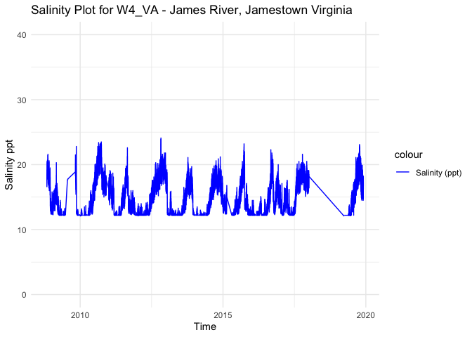
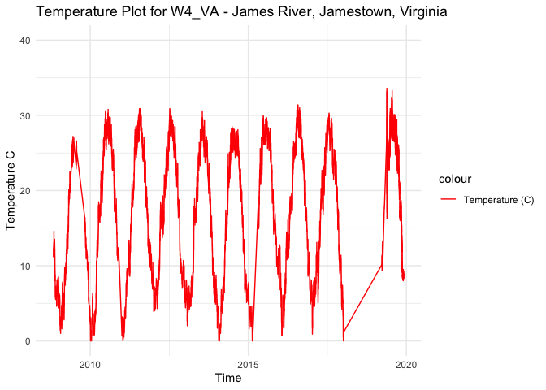
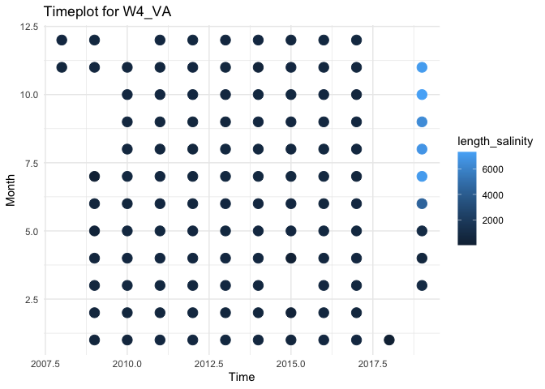
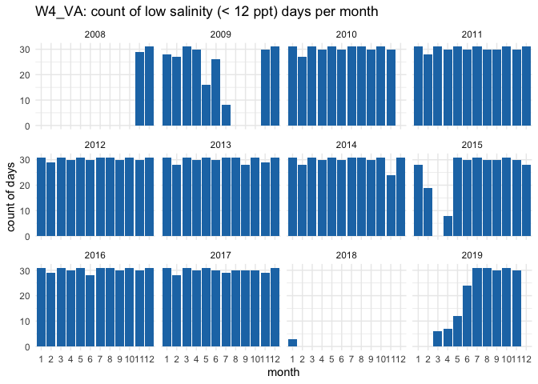
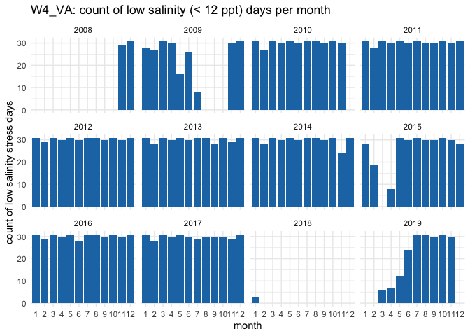
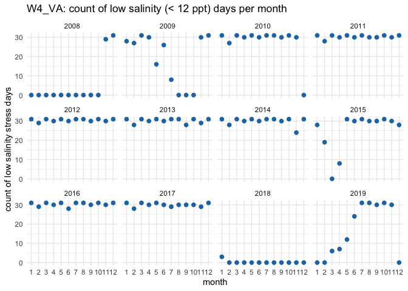
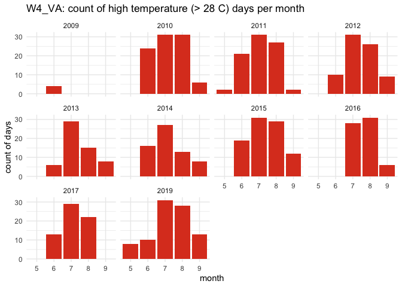
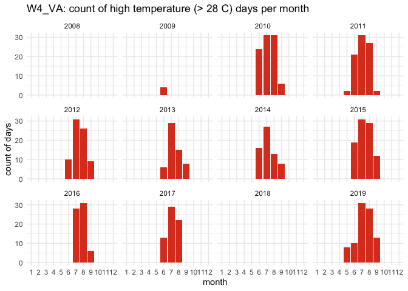
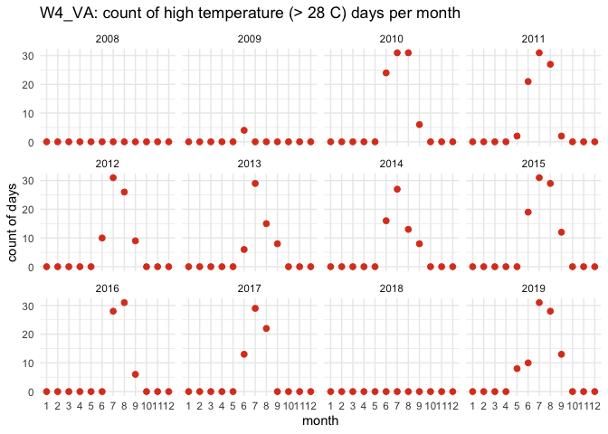

W4_W4_VA - Processed Environmental Data
================
Madeline Eppley
3/14/2025

``` r
setwd(dirname(rstudioapi::getActiveDocumentContext()$path))
```

``` r
library("dplyr") #Used for working with data frames
```

    ## 
    ## Attaching package: 'dplyr'

    ## The following objects are masked from 'package:stats':
    ## 
    ##     filter, lag

    ## The following objects are masked from 'package:base':
    ## 
    ##     intersect, setdiff, setequal, union

``` r
library("lubridate") #Used for time-date conversions
```

    ## 
    ## Attaching package: 'lubridate'

    ## The following objects are masked from 'package:base':
    ## 
    ##     date, intersect, setdiff, union

``` r
library("readr") #Used to read the CSV file
library("ggplot2") 
```

### Note the date of data download and source. All available data should be used for each site regardless of year. Note from the CSV file how often the site was sampled, and if there are replicates in the data. Also describe if the sampling occurred at only low tide, only high tide, or continuously.

``` r
#Data was downloaded on 10/01/2024
#Source - https://www.ndbc.noaa.gov/historical_data.shtml#ocean
#The site was sampled continuously every hour from 2008-2019. When compared to data from VIMS water quality monitoring in the York River, NDBC temperature data were on average 1.4°C higher than those recorded by VIMS and NDBC salinity data were on average 12.1 ppt lower than those recorded by VIMS. The data used here are the NDBC data with corrected temperature and salinity values, with temperature values 1.4°C lower and salinity values 12.1 ppt higher than the raw file. Datetime is already in POSIXct format. The corrected data were made in the W4_VA_Envr_Data_Corrections.Rmd file.

#Create text strings with metadata information that we want to include in the final data frame. 
download_date <- ("10-01-2024")
source_description <- ("NOAA National Buoy Data Center (NDBC), Chesapeake Bay Interpretive Buoy System with values corrected based on data from VIMS Water Quality Data")
site_name <- ("W4_VA") 
collection_type <- ("continuous")
```

### Use the file path name in your working directory or desktop, see example below. Or, import data set through the “Files” window in R studio. Store the file in a variable with the “raw_ID_Site” format. If salinity and temperature data are in separate files, read in both and store them with “\_sal” or “\_temp” in the variable names.

``` r
#The files we will be working with are from the James River, Jamestown, W4_VA. The ID_Site for this site W4_VA. 

#Environmental data could only be downloaded by year, so first we need to merge the yearly data sets.

#read in file
raw_W4_VA <- read.csv("../../data/envr_of_origin/raw_envr_data/VA-corrected.csv")

# View how the data are stored. Note the variable names and the format and units that the data are stored in.  
summary(raw_W4_VA)
```

    ##        X            datetime           temp_NDBC     salinity_NDBC   
    ##  Min.   :     1   Length:113786      Min.   : 0.00   Min.   : 0.000  
    ##  1st Qu.: 28447   Class :character   1st Qu.:11.80   1st Qu.: 0.400  
    ##  Median : 56894   Mode  :character   Median :21.50   Median : 2.600  
    ##  Mean   : 56894                      Mean   :19.97   Mean   : 3.268  
    ##  3rd Qu.: 85340                      3rd Qu.:27.60   3rd Qu.: 5.300  
    ##  Max.   :113786                      Max.   :99.00   Max.   :99.000  
    ##                                      NA's   :350     NA's   :350     
    ##  temp_corrected  salinity_corrected
    ##  Min.   :-1.40   Min.   : 12.10    
    ##  1st Qu.:10.40   1st Qu.: 12.50    
    ##  Median :20.10   Median : 14.70    
    ##  Mean   :18.57   Mean   : 15.37    
    ##  3rd Qu.:26.20   3rd Qu.: 17.40    
    ##  Max.   :97.60   Max.   :111.10    
    ##  NA's   :350     NA's   :350

``` r
#remove extra column X
raw_W4_VA <- subset(raw_W4_VA, select = -c(X))

#remove row with no time in the datetime column
raw_W4_VA <- raw_W4_VA[-c(1), ]

raw_W4_VA$datetime <- as.POSIXct(raw_W4_VA$datetime, "%Y-%m-%d %H:%M:%S", tz = "")

colnames(raw_W4_VA) <- c("datetime", "temp", "salinity", "corrected_temp", "corrected_salinity")

# we have NAs, so remove those
raw_W4_VA <- raw_W4_VA %>%
    filter(!is.na(datetime))
summary(raw_W4_VA$datetime)
```

    ##                       Min.                    1st Qu. 
    ## "2008-11-01 01:00:00.0000" "2012-09-26 21:15:00.0000" 
    ##                     Median                       Mean 
    ## "2016-05-02 15:30:00.0000" "2015-11-17 17:21:27.2551" 
    ##                    3rd Qu.                       Max. 
    ## "2019-08-01 09:10:30.0000" "2019-11-30 23:54:00.0000"

\###Standardize column and variable names. We will use “lat” for
latitude in degrees, and “lon” for longitude in degrees.

``` r
#Store variables that we will include in the final data frame. Lat and lon data from this site: https://www.ndbc.noaa.gov/station_history.php?station=44041
lat <- 37.211
lon <- -76.787
firstyear <- 2008
finalyear <- 2019
```

### Filter any of the variables that have data points outside of normal range. We will use 0-40 as the accepted range for salinity (ppt) and temperature (C) values. Note, in the summer, salinity values can sometimes exceed 40. Check to see if there are values above 40. In this case, adjust the range or notify someone that the site has particularly high salinity values.

``` r
#Filter the data between the values of 0 and 40 for both salinity and temperature. 
filtered_W4_VA_sal <- raw_W4_VA %>%
    filter(between(corrected_salinity, 0, 40)) 
           
filtered_W4_VA <- filtered_W4_VA_sal %>%
    filter(between(corrected_temp, 0, 40))

# Sanity check - print the ranges to ensure values are filtered properly. We can see that the ranges for both are now in the appropriate range.  
print(summary(filtered_W4_VA$corrected_salinity)) 
```

    ##    Min. 1st Qu.  Median    Mean 3rd Qu.    Max. 
    ##   12.10   12.50   14.70   15.21   17.40   24.10

``` r
print(summary(filtered_W4_VA$corrected_temp))
```

    ##    Min. 1st Qu.  Median    Mean 3rd Qu.    Max. 
    ##    0.00   10.50   20.30   18.53   26.20   33.60

``` r
#Store our data into a variable name with just the site name. 
W4_VA <- filtered_W4_VA

#re-check for NAs
count.nas_env <- is.na(W4_VA) # store our NAs in a variable
summary(count.nas_env) # we have no NAs in datetime
```

    ##   datetime          temp          salinity       corrected_temp 
    ##  Mode :logical   Mode :logical   Mode :logical   Mode :logical  
    ##  FALSE:109712    FALSE:109712    FALSE:109712    FALSE:109712   
    ##  corrected_salinity
    ##  Mode :logical     
    ##  FALSE:109712

\#Data sets for violin plots

``` r
#add site name and create new data frame with full envr data set
W4_VA <- W4_VA %>% 
  mutate(site_name, site_name = "W4_VA")

#reorder columns with site_name first
W4_VA <- W4_VA[, c(6, 1, 2, 3, 4, 5)]

W4_VA_temp_full <-W4_VA[, c(1,2,3,5)]

W4_VA_sal_full <- W4_VA[, c(1,2,4,6)]

#save W4_VA as csv for future analyses
write.csv(W4_VA_temp_full, "../../data/envr_of_origin/full_temp/W4_VA_temp_full.csv", row.names = FALSE)

write.csv(W4_VA_sal_full, "../../data/envr_of_origin/full_sal/W4_VA_sal_full.csv", row.names = FALSE)
```

### Visualize the salinity, temperature, and date ranges over time. This can help us see if there are any anomalies or gaps in the data and make sure the filtering was done correctly. Sanity check - do the temperature and salinity ranges look appropriate for the geography of the site (ex. near full ocean salinity for coastal sites, lower salinity for estuaries or near rivers)?

``` r
salplot <- ggplot(W4_VA, aes(x = datetime)) +
    geom_line(aes( y = corrected_salinity, color = "Salinity (ppt)")) +
    ylim(0,40) +
    labs(x = "Time", y = "Salinity ppt", title = "Salinity Plot for W4_VA - James River, Jamestown Virginia") +
    scale_color_manual(values = c("Salinity (ppt)" = "blue")) +
    theme_minimal()

salplot
```

<!-- -->

``` r
tempplot <- ggplot(W4_VA, aes(x = datetime)) +
    geom_line(aes(y = corrected_temp, color = "Temperature (C)")) +
    ylim(0, 40) +
    labs(x = "Time", y = "Temperature C", title = "Temperature Plot for W4_VA - James River, Jamestown, Virginia") +
    scale_color_manual(values = c( "Temperature (C)" = "red")) +
    theme_minimal()


tempplot
```

<!-- -->

### We need to calculate the mean, maximum, and minimum values for salinity and temperature per month and year. First make two data frames to contain each of the annual and monthly averages.

``` r
#Calculate the mean, maximum, and minimum values for salinity and temperature for each month. 
W4_VA_envrmonth <- W4_VA %>%
    mutate(year = year(datetime), month = month(datetime)) %>%
    group_by(year, month) %>%
    summarise(
      min_salinity = min(salinity),
      max_salinity = max(salinity),
      mean_salinity = mean(salinity),
      length_salinity = length(salinity),
      min_temp = min(temp),
      max_temp = max(temp),
      mean_temp = mean(temp),
      length_temp = length(temp))
```

    ## `summarise()` has grouped output by 'year'. You can override using the
    ## `.groups` argument.

``` r
print(W4_VA_envrmonth)
```

    ## # A tibble: 115 × 10
    ## # Groups:   year [12]
    ##     year month min_salinity max_salinity mean_salinity length_salinity min_temp
    ##    <dbl> <dbl>        <dbl>        <dbl>         <dbl>           <int>    <dbl>
    ##  1  2008    11          4.3          9.5         6.68              596      6.9
    ##  2  2008    12          0.3          8.3         2.98              687      6  
    ##  3  2009     1          0.2          3.8         1.24              571      2.4
    ##  4  2009     2          0.8          5           2.71              557      3  
    ##  5  2009     3          0.2          8.2         2.48              648      4.2
    ##  6  2009     4          0.1          2.4         0.405             566     12.5
    ##  7  2009     5          0.1          1.1         0.272             318     19.8
    ##  8  2009     6          0.1          1.2         0.360             538     24.5
    ##  9  2009     7          5.5          5.7         5.59              160     24.3
    ## 10  2009    11          0.1         10.7         2.86              644     11  
    ## # ℹ 105 more rows
    ## # ℹ 3 more variables: max_temp <dbl>, mean_temp <dbl>, length_temp <int>

``` r
#Calculate the mean, maximum, and minimum values for salinity and temperature for each year. 
W4_VA_envryear <- W4_VA %>%
    mutate(year = year(datetime)) %>%
    group_by(year) %>%
    summarise(
      min_salinity = min(salinity),
      max_salinity = max(salinity),
      mean_salinity = mean(salinity),
      min_temp = min(temp),
      max_temp = max(temp),
      mean_temp = mean(temp))

print(W4_VA_envryear)
```

    ## # A tibble: 12 × 7
    ##     year min_salinity max_salinity mean_salinity min_temp max_temp mean_temp
    ##    <dbl>        <dbl>        <dbl>         <dbl>    <dbl>    <dbl>     <dbl>
    ##  1  2008          0.3          9.5          4.7       6       16        9.64
    ##  2  2009          0.1         10.7          1.52      2.4     28.6     12.9 
    ##  3  2010          0           11.4          3.52      1.4     32.2     18.9 
    ##  4  2011          0.1         10.5          2.00      1.4     32.3     17.8 
    ##  5  2012          0           12            3.18      5.3     32.3     18.1 
    ##  6  2013          0.1          9            1.75      3.4     32       17.3 
    ##  7  2014          0.1          9.1          2.32      1.4     29.9     17.1 
    ##  8  2015          0.1         11.1          2.11      1.4     31.4     19.9 
    ##  9  2016          0.1         10.2          1.85      2.1     32.8     18.2 
    ## 10  2017          0.1          9.5          3.21      2.3     31.7     18.1 
    ## 11  2018          4.3          7            5.81      1.4      4.7      3.16
    ## 12  2019          0           11            4.16      9.4     35       23.8

``` r
#Calculate the mean, maximum, and minimum values for salinity and temperature for each day. 
W4_VA_envrday <- W4_VA %>%
    mutate(year = year(datetime), month = month(datetime), day = day(datetime)) %>%
    group_by(year, month, day) %>%
    summarise(
      min_salinity = min(salinity),
      max_salinity = max(salinity),
      mean_salinity = mean(salinity),
      length_salinity = length(salinity),
      min_temp = min(temp),
      max_temp = max(temp),
      mean_temp = mean(temp),
      length_temp = length(temp))
```

    ## `summarise()` has grouped output by 'year', 'month'. You can override using the
    ## `.groups` argument.

``` r
print(W4_VA_envrday)
```

    ## # A tibble: 3,296 × 11
    ## # Groups:   year, month [115]
    ##     year month   day min_salinity max_salinity mean_salinity length_salinity
    ##    <dbl> <dbl> <int>        <dbl>        <dbl>         <dbl>           <int>
    ##  1  2008    11     1          4.5          7.1          5.78              23
    ##  2  2008    11     2          5.1          8.2          6.23              23
    ##  3  2008    11     3          5.9          8.4          7.03              23
    ##  4  2008    11     4          5.6          8.2          6.69              18
    ##  5  2008    11     5          7            8.1          7.36              18
    ##  6  2008    11     6          7.4          8            7.74               9
    ##  7  2008    11     7          5.7          7.5          6.74              23
    ##  8  2008    11     8          6.2          8.6          7.26              20
    ##  9  2008    11     9          5.9          8.5          7.31               8
    ## 10  2008    11    10          5.8          8.5          7.18              21
    ## # ℹ 3,286 more rows
    ## # ℹ 4 more variables: min_temp <dbl>, max_temp <dbl>, mean_temp <dbl>,
    ## #   length_temp <int>

### Plot the months and years of data collection to check if there are any collection gaps in the data.

``` r
timeplot <- ggplot(W4_VA_envrmonth, aes(x = year)) +
    geom_point(aes(y = month, color = length_salinity), size = 4) +
    labs(x = "Time", y = "Month", title = "Timeplot for W4_VA") +
    ylim(1,12) +
    theme_minimal()

timeplot
```

<!-- -->

# Calculate days above and below thresholds and plot

``` r
# open up a blank data frame that spans all 12 months for all years of data collection for this site
# we will merge this with the observations so that we can plot over time 

complete_year_month <- expand.grid(
  year = unique(firstyear:finalyear),
  month = 1:12
)
```

# start with low salinity stress

``` r
# first calculate for low salinity
W4_VA$low_sal_stress <- W4_VA$salinity < 12

low_sal_stress_count <- W4_VA %>%
  mutate(year = year(datetime), 
         month = month(datetime), 
         day = day(datetime)) %>% 
  filter(low_sal_stress == 1) %>%  
  distinct(year, month, day) %>%  # remove dups
  group_by(year, month) %>%
  summarise(low_sal_stress = n(), .groups = "drop") # group all occurrences together by month rather than by numeric day

print(low_sal_stress_count)
```

    ## # A tibble: 115 × 3
    ##     year month low_sal_stress
    ##    <dbl> <dbl>          <int>
    ##  1  2008    11             29
    ##  2  2008    12             31
    ##  3  2009     1             28
    ##  4  2009     2             27
    ##  5  2009     3             31
    ##  6  2009     4             30
    ##  7  2009     5             16
    ##  8  2009     6             26
    ##  9  2009     7              8
    ## 10  2009    11             30
    ## # ℹ 105 more rows

``` r
# this plots low sal stress days only, years with no observations of low salinity stress will not appear in the graph 
ggplot(low_sal_stress_count, aes(x = factor(month), y = low_sal_stress, fill = factor(month))) +
  geom_bar(stat = "identity", fill = "#1f77b4") +
  facet_wrap(~ year) +
  labs(title = "W4_VA: count of low salinity (< 12 ppt) days per month",
       x = "month",
       y = "count of days") +
  theme_minimal()
```

<!-- -->

``` r
# Merge with the original dataset, filling missing values with 0 for low_sal_stress
low_sal_complete_data <- complete_year_month %>%
  left_join(low_sal_stress_count, by = c("year", "month")) %>%
  mutate(low_sal_stress = ifelse(is.na(low_sal_stress), 0, low_sal_stress))

low_sal_complete_data$month <- as.numeric(low_sal_complete_data$month)

# bars
ggplot(low_sal_complete_data, aes(x = factor(month), y = low_sal_stress)) +
  geom_bar(stat = "identity", fill = "#1f77b4") + 
  facet_wrap(~ year) +
  labs(title = "W4_VA: count of low salinity (< 12 ppt) days per month",
       x = "month",
       y = "count of low salinity stress days") +
  theme_minimal()
```

<!-- -->

``` r
# points
ggplot(low_sal_complete_data, aes(x = factor(month), y = low_sal_stress)) +
  geom_point(color = "#1f77b4", size = 2) + 
  facet_wrap(~ year) +  
  labs(title = "W4_VA: count of low salinity (< 12 ppt) days per month",
       x = "month",
       y = "count of low salinity stress days") +
  theme_minimal()
```

<!-- -->

# now calculate for high salinity stress

``` r
W4_VA$high_sal_stress <- W4_VA$salinity > 35

high_sal_stress_count <- W4_VA %>%
  mutate(year = year(datetime), 
         month = month(datetime), 
         day = day(datetime)) %>% 
  filter(high_sal_stress == 1) %>%  
  distinct(year, month, day) %>%  # remove dups
  group_by(year, month) %>%
  summarise(high_sal_stress = n(), .groups = "drop") # group all occurrences together by month rather than by numeric day

print(high_sal_stress_count) # no days of high salinity stress
```

    ## # A tibble: 0 × 3
    ## # ℹ 3 variables: year <dbl>, month <dbl>, high_sal_stress <int>

# high temp stress calculations

``` r
W4_VA$high_temp_stress <- W4_VA$temp > 28

high_temp_stress_count <- W4_VA %>%
  mutate(year = year(datetime), 
         month = month(datetime), 
         day = day(datetime)) %>% 
  filter(high_temp_stress == 1) %>%  
  distinct(year, month, day) %>%  # remove dups
  group_by(year, month) %>%
  summarise(high_temp_stress = n(), .groups = "drop") # group all occurrences together by month rather than by numeric day

print(high_temp_stress_count)
```

    ## # A tibble: 37 × 3
    ##     year month high_temp_stress
    ##    <dbl> <dbl>            <int>
    ##  1  2009     6                4
    ##  2  2010     6               24
    ##  3  2010     7               31
    ##  4  2010     8               31
    ##  5  2010     9                6
    ##  6  2011     5                2
    ##  7  2011     6               21
    ##  8  2011     7               31
    ##  9  2011     8               27
    ## 10  2011     9                2
    ## # ℹ 27 more rows

``` r
ggplot(high_temp_stress_count, aes(x = factor(month), y = high_temp_stress, fill = factor(month))) +
  geom_bar(stat = "identity", fill = "#DD4124FF") +
  facet_wrap(~ year) +
  labs(title = "W4_VA: count of high temperature (> 28 C) days per month",
       x = "month",
       y = "count of days") +
  theme_minimal()
```

<!-- -->

``` r
high_temp_complete_data <- complete_year_month %>%
  left_join(high_temp_stress_count, by = c("year", "month")) %>%
  mutate(high_temp_stress = ifelse(is.na(high_temp_stress), 0, high_temp_stress))

high_temp_complete_data$month <- as.numeric(high_temp_complete_data$month)

# bars
ggplot(high_temp_complete_data, aes(x = factor(month), y = high_temp_stress)) +
  geom_bar(stat = "identity", fill = "#DD4124FF") + 
  facet_wrap(~ year) +
  labs(title = "W4_VA: count of high temperature (> 28 C) days per month",
       x = "month",
       y = "count of days") +
  theme_minimal()
```

<!-- -->

``` r
# points
ggplot(high_temp_complete_data, aes(x = factor(month), y = high_temp_stress)) +
  geom_point(color = "#DD4124FF", size = 2) + 
  facet_wrap(~ year) +  
  labs(title = "W4_VA: count of high temperature (> 28 C) days per month",
       x = "month",
       y = "count of days") +
  theme_minimal()
```

<!-- -->

### We can now calculate a list of variables that we will have collected for all sites. This will allow us to compare sites easily. We will calculate the number of observations from each site, the mean annual, maximum annual, and minimum annual value for all variables.

Our list of variables includes:

- Mean_Annual_Temperature_C: average of all available data

- Mean_max_temperature_C: average of maximums for each year

- Mean_min_temperature_C: average of minimums for each year

- Temperature_st_dev: standard deviation of all available data

- Temperature_n: total number of data points

- Temperature_years: number of years in data set

- Mean_Annual_Salinity_ppt: average of all available data

- Mean_min_Salinity_ppt: average of minimums for each year

- Mean_max_Salinity_ppt: average of maximums for each year

- Salinity_st_dev: standard deviation of all available data

- Salinity_n: total number of data points

- Salinity_years: number of years in data set

``` r
#Calculate temperature variables. 
Mean_Annual_Temperature_C <- mean(W4_VA$temp)
Mean_max_temperature_C <- mean(W4_VA_envryear$max_temp)
Mean_min_temperature_C <- mean(W4_VA_envryear$min_temp)
Temperature_st_dev <- sd(W4_VA$temp)
Temperature_n <- nrow(W4_VA)
Temperature_years <- nrow(W4_VA_envryear)
high_temp_stress_days <- sum(high_temp_stress_count$high_temp_stress)
frac_high_temp_stress_days <- high_temp_stress_days/nrow(W4_VA_envrday)
temp_quantile_10 <- quantile(W4_VA$temp, 0.1)
temp_quantile_90 <- quantile(W4_VA$temp, 0.9)

Mean_Monthly_Temperature_C <- W4_VA_envrmonth %>%
  filter(!is.na(month)) %>% 
  group_by(month) %>%
  summarise(Mean_Temperature = mean(mean_temp))

Mean_min_Monthly_Temperature_C <- W4_VA_envrmonth %>%
  filter(!is.na(month)) %>% 
  group_by(month) %>%
  summarise(Mean_min_Temperature = mean(min_temp))

Mean_max_Monthly_Temperature_C <- W4_VA_envrmonth %>%
  filter(!is.na(month)) %>% 
  group_by(month) %>%
  summarise(Mean_max_Temperature = mean(max_temp))

#Create a data frame to store the temperature results
W4_VA_temp <- cbind(site_name, download_date, source_description, lat, lon, firstyear, finalyear, Mean_Annual_Temperature_C, Mean_max_temperature_C, Mean_min_temperature_C, temp_quantile_10, temp_quantile_90, Temperature_st_dev, high_temp_stress_days, frac_high_temp_stress_days, Temperature_n, Temperature_years, collection_type)
print(W4_VA_temp)
```

    ##     site_name download_date
    ## 10% "W4_VA"   "10-01-2024" 
    ##     source_description                                                                                                                               
    ## 10% "NOAA National Buoy Data Center (NDBC), Chesapeake Bay Interpretive Buoy System with values corrected based on data from VIMS Water Quality Data"
    ##     lat      lon       firstyear finalyear Mean_Annual_Temperature_C
    ## 10% "37.211" "-76.787" "2008"    "2019"    "19.9346352267756"       
    ##     Mean_max_temperature_C Mean_min_temperature_C temp_quantile_10
    ## 10% "28.2416666666667"     "3.15833333333333"     "7.5"           
    ##     temp_quantile_90 Temperature_st_dev high_temp_stress_days
    ## 10% "29.5"           "8.48879806824356" "687"                
    ##     frac_high_temp_stress_days Temperature_n Temperature_years collection_type
    ## 10% "0.208434466019417"        "109712"      "12"              "continuous"

``` r
W4_VA_monthly_temp <- cbind(Mean_Monthly_Temperature_C, Mean_min_Monthly_Temperature_C, Mean_max_Monthly_Temperature_C)
W4_VA_monthly_temp <- W4_VA_monthly_temp[, !duplicated(names(W4_VA_monthly_temp))]
print(W4_VA_monthly_temp)
```

    ##    month Mean_Temperature Mean_min_Temperature Mean_max_Temperature
    ## 1      1         5.342970             2.410000             8.490000
    ## 2      2         6.055410             3.466667             9.033333
    ## 3      3        10.692685             7.011111            14.355556
    ## 4      4        16.286314            12.370000            20.690000
    ## 5      5        22.148270            17.960000            27.300000
    ## 6      6        26.865734            24.110000            30.160000
    ## 7      7        29.055802            26.840000            31.680000
    ## 8      8        28.513057            26.144444            31.111111
    ## 9      9        25.797862            22.722222            29.366667
    ## 10    10        20.210673            15.844444            25.011111
    ## 11    11        13.055516             9.545455            17.509091
    ## 12    12         8.946111             6.411111            11.988889

``` r
# Write to the combined file with all sites 
write.table(W4_VA_temp, "/Users/madelineeppley/GitHub/MVP-H2F-HatcheryField/data/environment/all_temperature.csv", sep = ",", append = TRUE, col.names = FALSE, row.names = FALSE) # The column names should be changed to FALSE after 1st row is added to the data frame

# Write to a unique new CSV file
write.csv(W4_VA_temp, "/Users/madelineeppley/GitHub/MVP-H2F-HatcheryField/data/environment/W4_VA_temperature.csv")

# Write all montly data to a unique new CSV file
write.csv(W4_VA_monthly_temp, "/Users/madelineeppley/GitHub/MVP-H2F-HatcheryField/data/environment/W4_VA_monthly_temp.csv")
```

``` r
#Calculate the salinity variables
Mean_Annual_Salinity_ppt <- mean(W4_VA$salinity)
Mean_max_Salinity_ppt <- mean(W4_VA_envryear$max_salinity)
Mean_min_Salinity_ppt <- mean(W4_VA_envryear$min_salinity)
Salinity_st_dev <- sd(W4_VA$salinity)
Salinity_n <- nrow(W4_VA)
Salinity_years <- nrow(W4_VA_envryear)
high_sal_stress_days <- sum(high_sal_stress_count$high_sal_stress)
low_sal_stress_days <- sum(low_sal_stress_count$low_sal_stress)
frac_high_sal_stress_days <- high_sal_stress_days/nrow(W4_VA_envrday)
frac_low_sal_stress_days <- low_sal_stress_days/nrow(W4_VA_envrday)
salinity_quantile_10 <- quantile(W4_VA$salinity, 0.1)
salinity_quantile_90 <- quantile(W4_VA$salinity, 0.9)

Mean_Monthly_Salinity <- W4_VA_envrmonth %>%
  filter(!is.na(month)) %>%
  group_by(month) %>%
  summarise(Mean_Salinity = mean(mean_salinity))

Min_Monthly_Salinity <- W4_VA_envrmonth %>%
  filter(!is.na(month)) %>%
  group_by(month) %>%
  summarise(Min_Salinity = mean(min_salinity))

Max_Monthly_Salinity <- W4_VA_envrmonth %>%
  filter(!is.na(month)) %>%
  group_by(month) %>%
  summarise(Max_Salinity = mean(max_salinity))

#Create a data frame to store the temperature results
W4_VA_salinity <- cbind(site_name, download_date, source_description, lat, lon, firstyear, finalyear, Mean_Annual_Salinity_ppt, Mean_max_Salinity_ppt, Mean_min_Salinity_ppt, salinity_quantile_10, salinity_quantile_90, high_sal_stress_days,low_sal_stress_days, frac_high_sal_stress_days, frac_low_sal_stress_days, Salinity_st_dev, Salinity_n, Salinity_years, collection_type)
print(W4_VA_salinity)
```

    ##     site_name download_date
    ## 10% "W4_VA"   "10-01-2024" 
    ##     source_description                                                                                                                               
    ## 10% "NOAA National Buoy Data Center (NDBC), Chesapeake Bay Interpretive Buoy System with values corrected based on data from VIMS Water Quality Data"
    ##     lat      lon       firstyear finalyear Mean_Annual_Salinity_ppt
    ## 10% "37.211" "-76.787" "2008"    "2019"    "3.10822608283506"      
    ##     Mean_max_Salinity_ppt Mean_min_Salinity_ppt salinity_quantile_10
    ## 10% "10.0833333333333"    "0.441666666666667"   "0.1"               
    ##     salinity_quantile_90 high_sal_stress_days low_sal_stress_days
    ## 10% "7"                  "0"                  "3296"             
    ##     frac_high_sal_stress_days frac_low_sal_stress_days Salinity_st_dev   
    ## 10% "0"                       "1"                      "2.70141647539953"
    ##     Salinity_n Salinity_years collection_type
    ## 10% "109712"   "12"           "continuous"

``` r
W4_VA_monthly_sal <- cbind(Mean_Monthly_Salinity, Min_Monthly_Salinity, Max_Monthly_Salinity)
W4_VA_monthly_sal <- W4_VA_monthly_sal[, !duplicated(names(W4_VA_monthly_sal))]
print(W4_VA_monthly_sal)
```

    ##    month Mean_Salinity Min_Salinity Max_Salinity
    ## 1      1     1.8540558    0.7000000     3.970000
    ## 2      2     1.1072670    0.2888889     3.255556
    ## 3      3     0.8223613    0.1444444     3.122222
    ## 4      4     0.4208329    0.1000000     1.710000
    ## 5      5     0.3608901    0.1100000     1.680000
    ## 6      6     0.9509338    0.1300000     2.970000
    ## 7      7     2.7567906    1.1500000     5.360000
    ## 8      8     4.5617025    2.1111111     8.088889
    ## 9      9     5.7168381    2.9777778     8.788889
    ## 10    10     4.8075755    2.5222222     9.000000
    ## 11    11     4.4173822    2.3272727     7.654545
    ## 12    12     2.7323488    1.1777778     5.666667

``` r
# Write to the combined file with all sites 
write.table(W4_VA_salinity, "/Users/madelineeppley/GitHub/MVP-H2F-HatcheryField/data/environment/all_salinity.csv", sep = ",", append = TRUE, col.names = FALSE, row.names = FALSE) # The column names should be changed to FALSE after 1st row is added to the data frame

# Write all year data to a unique new CSV file
write.csv(W4_VA_salinity, "/Users/madelineeppley/GitHub/MVP-H2F-HatcheryField/data/environment/W4_VA_salinity.csv")
# Write all montly data to a unique new CSV file
write.csv(W4_VA_monthly_sal, "/Users/madelineeppley/GitHub/MVP-H2F-HatcheryField/data/environment/W4_VA_monthly_sal.csv")
```
