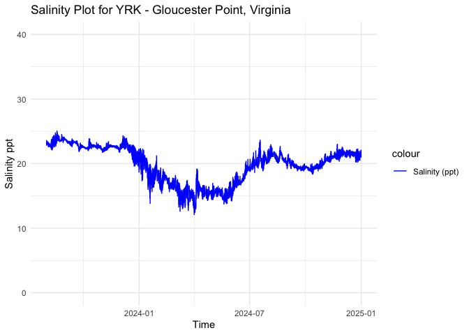
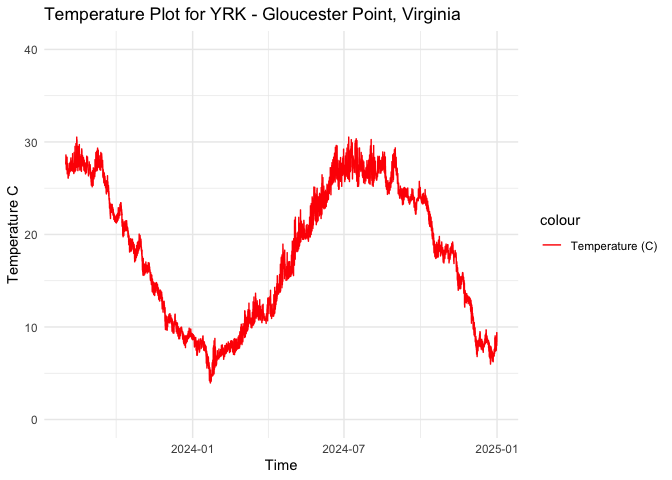
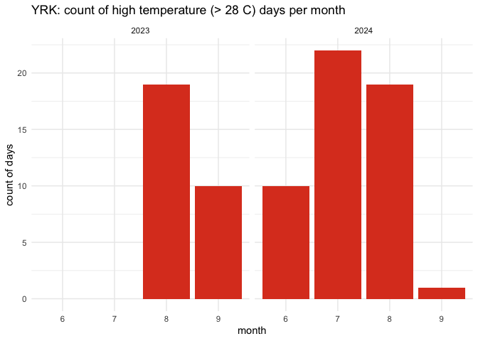
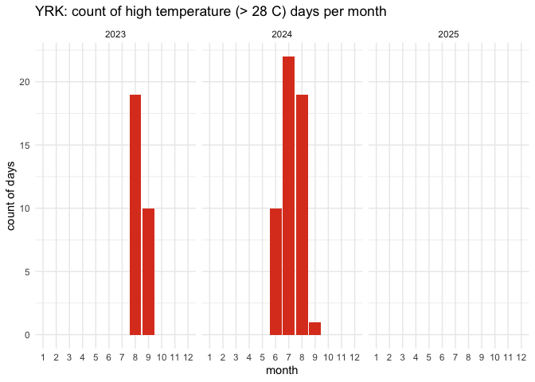
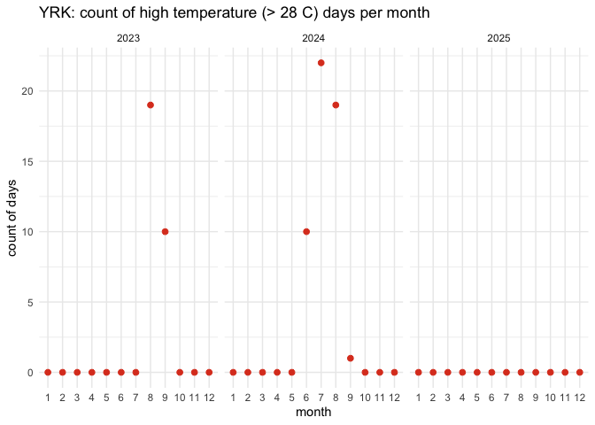

YRK_EnvrData
================
Nicole Mongillo
2025-04-03

``` r
setwd(dirname(rstudioapi::getActiveDocumentContext()$path))
```

### Load required packages.

``` r
library("dplyr") #Used for working with data frames
```

    ## 
    ## Attaching package: 'dplyr'

    ## The following objects are masked from 'package:stats':
    ## 
    ##     filter, lag

    ## The following objects are masked from 'package:base':
    ## 
    ##     intersect, setdiff, setequal, union

``` r
library("lubridate") #Used for time-date conversions
```

    ## 
    ## Attaching package: 'lubridate'

    ## The following objects are masked from 'package:base':
    ## 
    ##     date, intersect, setdiff, union

``` r
library("readr") #Used to read the CSV file
library("ggplot2") 
```

### Note the date of data download and source. All available data should be used for each site regardless of year. Note from the CSV file how often the site was sampled, and if there are replicates in the data. Also describe if the sampling occurred at only low tide, only high tide, or continuously.

``` r
#Data was downloaded on 04/02/2024
#Source - http://vecos.vims.edu/StationDetail.aspx?param=YRK005.40&program=CMON

#Chesapeake Bay National Estuarine Research Reserve in Virginia, Virginia Institute of Marine Science (CBNERR-VA VIMS), 2025. Virginia Estuarine and Coastal Observing System (VECOS). Data accessed from VECOS website: http://vecos.vims.edu; accessed 28 February 2025.
#The site was sampled continuously every 15 min from 2003

#Create text strings with metadata information that we want to include in the final data frame. 
download_date <- ("02-28-2025")
source_description <- ("Virginia Estuarine and Coastal Observing System, VIMS")
site_name <- ("YRK") 
collection_type <- ("continuous")
```

### Use the file path name in your working directory or desktop, see example below. Or, import data set through the “Files” window in R studio. Store the file in a variable with the “raw_ID_Site” format. If salinity and temperature data are in separate files, read in both and store them with “\_sal” or “\_temp” in the variable names.

``` r
#The files we will be working with are from Gloucester Point, VA, which is for the DEBY selection line. The ID_Site for this site is DEBY. 

#Environmental data could only be downloaded by year, so first we need to merge the yearly data sets.


file1 <- read.csv("YRK-2023-raw.csv")
file2 <- read.csv("YRK-2024-raw.csv")

# combine using rbind
raw_YRK <- rbind(file1, file2)


#The metadata for these data (located at the bottom of this site: http://vecos.vims.edu/Content.aspx?idContent=44) explain the various error codes listed alongside observations that are unusable or questionable. Error codes for a certain water quality observation are listed in a column titled WATERQUALITY_A, where WATERQUALITY is whatever aspect of water quality is being measured. For example, next to the SALINITY column is SALINITY_A, which lists error codes for salinity observations if applicable. Blank or NA WATERQUALITY_A cells indicate no error code is applicable. We need to remove observations marked with these codes by keeping only data with blank cells or NA in these columns.

YRK_error <- subset(raw_YRK, select = c(SAMPLE_DATETIME, WTEMP, WTEMP_A, SALINITY, SALINITY_A)) #subset data to include sample collection day and time, water temperature, water temperature error codes, salinity, and salinity error codes

subset1_YRK_error <- YRK_error[(YRK_error$WTEMP_A %in% c("", NA)), ] #keep only rows where the WTEMP_A columns are blank or NA, i.e. where there were no error codes recorded for the temperature data, and save it to a new data frame

subset2_YRK_error <- subset1_YRK_error[(subset1_YRK_error$SALINITY_A %in% c("", NA)),] #keep only rows where the SALINITY_A columns are blank or NA, i.e. where there were no error codes recorded for the salinity data, and save it to a new data frame

#View(subset2_YRK_error)
#sorting the data frame by ascending and descending values for WTEMP_A and SALINITY_A shows only blank cells or NA for each of those columns. We have removed the data marked with error codes

raw_YRK <- subset(subset2_YRK_error, select = c(SAMPLE_DATETIME, WTEMP, SALINITY)) #remove WTEMP_A and SALINITY_A from the dataframe now

# View how the data are stored. Note the variable names and the format and units that the data are stored in.  
summary(raw_YRK)
```

    ##  SAMPLE_DATETIME        WTEMP           SALINITY    
    ##  Length:57581       Min.   : 3.013   Min.   :12.10  
    ##  Class :character   1st Qu.:11.100   1st Qu.:18.21  
    ##  Mode  :character   Median :19.336   Median :20.46  
    ##                     Mean   :18.304   Mean   :19.90  
    ##                     3rd Qu.:24.822   3rd Qu.:22.02  
    ##                     Max.   :30.524   Max.   :25.06

``` r
#rename columns. "datetime" = date and time of data collection, "temp" = water temperature in degrees C, "salinity" = water salinity in parts per thousand (ppt)

colnames(raw_YRK) <- c("datetime", "temp", "salinity")
```

### Start with the date and time of collection. We will use the lubridate package to standardize all values into the date-time format called POSIXct. This format stores the date and time in number of seconds since a past point (01/01/1970). This makes comparisons easy and helps to standardizes values.

``` r
#Convert to POSIXct format. Tell R what the current date/time format is so it knows how to convert it. Store it into a column named datetime in the data frame.
raw_YRK$datetime <- as.POSIXct(raw_YRK$datetime, "%Y-%m-%d %H:%M:%S", tz = "")


#Print the new data frame and examine to make sure the new datetime column is in the correct format. 
head(raw_YRK)
```

    ##              datetime   temp salinity
    ## 1 2023-05-01 00:00:00 17.629    21.70
    ## 2 2023-05-01 00:15:00 17.830    21.52
    ## 3 2023-05-01 00:30:00 17.776    21.57
    ## 4 2023-05-01 00:45:00 17.687    21.61
    ## 5 2023-05-01 01:00:00 17.678    21.62
    ## 6 2023-05-01 01:15:00 17.688    21.63

``` r
#exclude time before 1 August 2023 (approximate start of field data) and after 31 December 2024
raw_YRK <- raw_YRK %>% 
  filter(datetime >= 1690848000 & datetime <=1735689599)

#Print the new data frame and examine to make sure the new datetime column is in the correct format. 
summary(raw_YRK$datetime)
```

    ##                       Min.                    1st Qu. 
    ## "2023-08-01 09:45:00.0000" "2023-12-08 18:26:15.0000" 
    ##                     Median                       Mean 
    ## "2024-04-16 20:52:30.0000" "2024-04-16 17:44:03.0016" 
    ##                    3rd Qu.                       Max. 
    ## "2024-08-24 13:33:45.0000" "2024-12-31 18:45:00.0000"

``` r
# we have NAs, so remove those
raw_YRK <- raw_YRK %>%
    filter(!is.na(datetime))

# double check that the NA removal worked
summary(raw_YRK$datetime)
```

    ##                       Min.                    1st Qu. 
    ## "2023-08-01 09:45:00.0000" "2023-12-08 18:26:15.0000" 
    ##                     Median                       Mean 
    ## "2024-04-16 20:52:30.0000" "2024-04-16 17:44:03.0016" 
    ##                    3rd Qu.                       Max. 
    ## "2024-08-24 13:33:45.0000" "2024-12-31 18:45:00.0000"

### \#Standardize column and variable names. We will use “lat” for latitude in degrees, and “lon” for longitude in degrees.

``` r
#Store variables that we will include in the final data frame
lat <- 37.247284
lon <- -76.499369
firstyear <- 2023
finalyear <- 2025
```

### Filter any of the variables that have data points outside of normal range. We will use 0-40 as the accepted range for salinity (ppt) and temperature (C) values. Note, in the summer, salinity values can sometimes exceed 40. Check to see if there are values above 40. In this case, adjust the range or notify someone that the site has particularly high salinity values.

``` r
#Filter the data between the values of 0 and 40 for both salinity and temperature. 
filtered_YRK_sal <- raw_YRK %>%
    filter(between(salinity, 0, 40)) 
           
filtered_YRK_env <- filtered_YRK_sal %>%
    filter(between(temp, 0, 40))

# Sanity check - print the ranges to ensure values are filtered properly. We can see that the ranges for both are now in the appropriate range.  
print(summary(filtered_YRK_env$salinity)) 
```

    ##    Min. 1st Qu.  Median    Mean 3rd Qu.    Max. 
    ##   12.10   17.48   20.37   19.77   22.25   25.06

``` r
print(summary(filtered_YRK_env$temp))
```

    ##    Min. 1st Qu.  Median    Mean 3rd Qu.    Max. 
    ##   3.947  10.844  18.514  18.102  25.234  30.524

``` r
#Store our data into a variable name with just the site name. 
YRK <- filtered_YRK_env
```

### Visualize the salinity, temperature, and date ranges over time. This can help us see if there are any anomalies or gaps in the data and make sure the filtering was done correctly. Sanity check - do the temperature and salinity ranges look appropriate for the geography of the site (ex. near full ocean salinity for coastal sites, lower salinity for estuaries or near rivers)?

``` r
salplot <- ggplot(YRK, aes(x = datetime)) +
    geom_line(aes(y = salinity, color = "Salinity (ppt)")) +
    ylim(0,40) +
    labs(x = "Time", y = "Salinity ppt", title = "Salinity Plot for YRK - Gloucester Point, Virginia") +
    scale_color_manual(values = c("Salinity (ppt)" = "blue")) +
    theme_minimal()


salplot
```

<!-- -->

``` r
tempplot <- ggplot(YRK, aes(x = datetime)) +
    geom_line(aes(y = temp, color = "Temperature (C)")) +
    ylim(0, 40) +
    labs(x = "Time", y = "Temperature C", title = "Temperature Plot for YRK - Gloucester Point, Virginia") +
    scale_color_manual(values = c( "Temperature (C)" = "red")) +
    theme_minimal()

tempplot
```

<!-- -->

### We need to calculate the mean, maximum, and minimum values for salinity and temperature per month and year. First make two data frames to contain each of the annual and monthly averages.

``` r
#Calculate the mean, maximum, and minimum values for salinity and temperature for each month. 
YRK_envrmonth <- YRK %>%
    mutate(year = year(datetime), month = month(datetime)) %>%
    group_by(year, month) %>%
    summarise(
      min_salinity = min(salinity),
      max_salinity = max(salinity),
      mean_salinity = mean(salinity),
      length_salinity = length(salinity),
      min_temp = min(temp),
      max_temp = max(temp),
      mean_temp = mean(temp),
      length_temp = length(temp))
```

    ## `summarise()` has grouped output by 'year'. You can override using the
    ## `.groups` argument.

``` r
print(YRK_envrmonth)
```

    ## # A tibble: 17 × 10
    ## # Groups:   year [2]
    ##     year month min_salinity max_salinity mean_salinity length_salinity min_temp
    ##    <dbl> <dbl>        <dbl>        <dbl>         <dbl>           <int>    <dbl>
    ##  1  2023     8         22.1         25.1          23.4            2934    25.7 
    ##  2  2023     9         21.9         23.8          23.1            2880    21.3 
    ##  3  2023    10         22.0         23.9          22.6            2974    17.0 
    ##  4  2023    11         21.8         23.4          22.5            2869     9.70
    ##  5  2023    12         18.7         24.3          22.1            2946     7.77
    ##  6  2024     1         13.8         22.3          19.0            2967     3.95
    ##  7  2024     2         15.4         19.4          17.2            2751     6.51
    ##  8  2024     3         12.1         17.9          15.1            2961     8.39
    ##  9  2024     4         12.4         19.2          15.5            2875    10.9 
    ## 10  2024     5         13.7         17.2          15.3            2959    15.6 
    ## 11  2024     6         14.2         20.6          17.5            2868    21.7 
    ## 12  2024     7         18.6         23.6          20.2            2966    25.2 
    ## 13  2024     8         19.2         23.0          21.0            2972    24.3 
    ## 14  2024     9         18.9         21.5          19.7            2880    22.2 
    ## 15  2024    10         18.4         20.8          19.5            2974    16.9 
    ## 16  2024    11         20           23.0          21.0            2880    11.5 
    ## 17  2024    12         20.2         22.5          21.4            2956     5.99
    ## # ℹ 3 more variables: max_temp <dbl>, mean_temp <dbl>, length_temp <int>

``` r
#Calculate the mean, maximum, and minimum values for salinity and temperature for each year. 
YRK_envryear <- YRK %>%
    mutate(year = year(datetime)) %>%
    group_by(year) %>%
    summarise(
      min_salinity = min(salinity),
      max_salinity = max(salinity),
      mean_salinity = mean(salinity),
      min_temp = min(temp),
      max_temp = max(temp),
      mean_temp = mean(temp))

print(YRK_envryear)
```

    ## # A tibble: 2 × 7
    ##    year min_salinity max_salinity mean_salinity min_temp max_temp mean_temp
    ##   <dbl>        <dbl>        <dbl>         <dbl>    <dbl>    <dbl>     <dbl>
    ## 1  2023         18.7         25.1          22.7     7.77     30.5      19.4
    ## 2  2024         12.1         23.6          18.5     3.95     30.5      17.5

``` r
#Calculate the mean, maximum, and minimum values for salinity and temperature for each day. 
YRK_envrday <- YRK %>%
    mutate(year = year(datetime), month = month(datetime), day = day(datetime)) %>%
    group_by(year, month, day) %>%
    summarise(
      min_salinity = min(salinity),
      max_salinity = max(salinity),
      mean_salinity = mean(salinity),
      length_salinity = length(salinity),
      min_temp = min(temp),
      max_temp = max(temp),
      mean_temp = mean(temp),
      length_temp = length(temp))
```

    ## `summarise()` has grouped output by 'year', 'month'. You can override using the
    ## `.groups` argument.

``` r
print(YRK_envrday)
```

    ## # A tibble: 519 × 11
    ## # Groups:   year, month [17]
    ##     year month   day min_salinity max_salinity mean_salinity length_salinity
    ##    <dbl> <dbl> <int>        <dbl>        <dbl>         <dbl>           <int>
    ##  1  2023     8     1         22.8         23.6          23.2              57
    ##  2  2023     8     2         22.9         23.4          23.2              96
    ##  3  2023     8     3         23.0         23.4          23.2              96
    ##  4  2023     8     4         22.6         23.3          22.9              96
    ##  5  2023     8     5         22.7         23.2          23.0              96
    ##  6  2023     8     6         22.6         23.0          22.8              96
    ##  7  2023     8     7         22.6         23.0          22.8              96
    ##  8  2023     8     8         22.5         23.3          22.8              96
    ##  9  2023     8     9         22.2         23.7          23.0              96
    ## 10  2023     8    10         22.1         23.8          22.8              96
    ## # ℹ 509 more rows
    ## # ℹ 4 more variables: min_temp <dbl>, max_temp <dbl>, mean_temp <dbl>,
    ## #   length_temp <int>

### Plot the months and years of data collection to check if there are any collection gaps in the data.

``` r
timeplot <- ggplot(YRK_envrmonth, aes(x = year)) +
    geom_point(aes(y = month, color = length_salinity), size = 4) +
    labs(x = "Time", y = "Month", title = "Salinity Timeplot for YRK - Gloucester Point, Virginia") +
    ylim(1,12) +
    theme_minimal()

timeplot
```

<!-- -->

# Calculate days above and below thresholds and plot

``` r
# open up a blank data frame that spans all 12 months for all years of data collection for this site
# we will merge this with the observations so that we can plot over time 

complete_year_month <- expand.grid(
  year = unique(firstyear:finalyear),
  month = 1:12
)
```

# start with low salinity stress

``` r
# first calculate for low salinity
YRK$low_sal_stress <- YRK$salinity < 12

low_sal_stress_count <- YRK %>%
  mutate(year = year(datetime), 
         month = month(datetime), 
         day = day(datetime)) %>% 
  filter(low_sal_stress == 1) %>%  
  distinct(year, month, day) %>%  # remove dups
  group_by(year, month) %>%
  summarise(low_sal_stress = n(), .groups = "drop") # group all occurrences together by month rather than by numeric day

print(low_sal_stress_count) # 0 days of low salinity stress
```

    ## # A tibble: 0 × 3
    ## # ℹ 3 variables: year <dbl>, month <dbl>, low_sal_stress <int>

# now calculate for high salinity stress

``` r
YRK$high_sal_stress <- YRK$salinity > 35

high_sal_stress_count <- YRK %>%
  mutate(year = year(datetime), 
         month = month(datetime), 
         day = day(datetime)) %>% 
  filter(high_sal_stress == 1) %>%  
  distinct(year, month, day) %>%  # remove dups
  group_by(year, month) %>%
  summarise(high_sal_stress = n(), .groups = "drop") # group all occurrences together by month rather than by numeric day

print(high_sal_stress_count) # no high sal stress 
```

    ## # A tibble: 0 × 3
    ## # ℹ 3 variables: year <dbl>, month <dbl>, high_sal_stress <int>

# high temp stress calculations

``` r
YRK$high_temp_stress <- YRK$temp > 28

high_temp_stress_count <- YRK %>%
  mutate(year = year(datetime), 
         month = month(datetime), 
         day = day(datetime)) %>% 
  filter(high_temp_stress == 1) %>%  
  distinct(year, month, day) %>%  # remove dups
  group_by(year, month) %>%
  summarise(high_temp_stress = n(), .groups = "drop") # group all occurrences together by month rather than by numeric day

print(high_temp_stress_count)
```

    ## # A tibble: 6 × 3
    ##    year month high_temp_stress
    ##   <dbl> <dbl>            <int>
    ## 1  2023     8               19
    ## 2  2023     9               10
    ## 3  2024     6               10
    ## 4  2024     7               22
    ## 5  2024     8               19
    ## 6  2024     9                1

``` r
ggplot(high_temp_stress_count, aes(x = factor(month), y = high_temp_stress, fill = factor(month))) +
  geom_bar(stat = "identity", fill = "#DD4124FF") +
  facet_wrap(~ year) +
  labs(title = "YRK: count of high temperature (> 28 C) days per month",
       x = "month",
       y = "count of days") +
  theme_minimal()
```

<!-- -->

``` r
high_temp_complete_data <- complete_year_month %>%
  left_join(high_temp_stress_count, by = c("year", "month")) %>%
  mutate(high_temp_stress = ifelse(is.na(high_temp_stress), 0, high_temp_stress))

high_temp_complete_data$month <- as.numeric(high_temp_complete_data$month)

# bars
ggplot(high_temp_complete_data, aes(x = factor(month), y = high_temp_stress)) +
  geom_bar(stat = "identity", fill = "#DD4124FF") + 
  facet_wrap(~ year) +
  labs(title = "YRK: count of high temperature (> 28 C) days per month",
       x = "month",
       y = "count of days") +
  theme_minimal()
```

<!-- -->

``` r
# points
ggplot(high_temp_complete_data, aes(x = factor(month), y = high_temp_stress)) +
  geom_point(color = "#DD4124FF", size = 2) + 
  facet_wrap(~ year) +  
  labs(title = "YRK: count of high temperature (> 28 C) days per month",
       x = "month",
       y = "count of days") +
  theme_minimal()
```

<!-- -->

### We can now calculate a list of variables that we will have collected for all sites. This will allow us to compare sites easily. We will calculate the number of observations from each site, the mean annual, maximum annual, and minimum annual value for all variables.

Our list of variables includes:

- Mean_Annual_Temperature_C: average of all available data

- Mean_max_temperature_C: average of maximums for each year

- Mean_min_temperature_C: average of minimums for each year

- Temperature_st_dev: standard deviation of all available data

- Temperature_n: total number of data points

- Temperature_years: number of years in data set

- Mean_Annual_Salinity_ppt: average of all available data

- Mean_min_Salinity_ppt: average of minimums for each year

- Mean_max_Salinity_ppt: average of maximums for each year

- Salinity_st_dev: standard deviation of all available data

- Salinity_n: total number of data points

- Salinity_years: number of years in data set

``` r
#Calculate temperature variables. 
Mean_Annual_Temperature_C <- mean(YRK$temp)
Mean_max_temperature_C <- mean(YRK_envryear$max_temp)
Mean_min_temperature_C <- mean(YRK_envryear$min_temp)
Temperature_st_dev <- sd(YRK$temp)
Temperature_n <- nrow(YRK)
Temperature_years <- nrow(YRK_envryear)
high_temp_stress_days <- sum(high_temp_stress_count$high_temp_stress)
frac_high_temp_stress_days <- high_temp_stress_days/nrow(YRK_envrday)
temp_quantile_10 <- quantile(YRK$temp, 0.1)
temp_quantile_90 <- quantile(YRK$temp, 0.9)

Mean_Monthly_Temperature_C <- YRK_envrmonth %>%
  filter(!is.na(month)) %>% 
  group_by(month) %>%
  summarise(Mean_Temperature = mean(mean_temp))

Mean_min_Monthly_Temperature_C <- YRK_envrmonth %>%
  filter(!is.na(month)) %>% 
  group_by(month) %>%
  summarise(Mean_min_Temperature = mean(min_temp))

Mean_max_Monthly_Temperature_C <- YRK_envrmonth %>%
  filter(!is.na(month)) %>% 
  group_by(month) %>%
  summarise(Mean_max_Temperature = mean(max_temp))

#Create a data frame to store the temperature results
YRK_temp <- cbind(site_name, download_date, source_description, lat, lon, firstyear, finalyear, Mean_Annual_Temperature_C, Mean_max_temperature_C, Mean_min_temperature_C, temp_quantile_10, temp_quantile_90, Temperature_st_dev, high_temp_stress_days, frac_high_temp_stress_days, Temperature_n, Temperature_years, collection_type)
print(YRK_temp)
```

    ##     site_name download_date
    ## 10% "YRK"     "02-28-2025" 
    ##     source_description                                      lat        
    ## 10% "Virginia Estuarine and Coastal Observing System, VIMS" "37.247284"
    ##     lon          firstyear finalyear Mean_Annual_Temperature_C
    ## 10% "-76.499369" "2023"    "2025"    "18.1019874627106"       
    ##     Mean_max_temperature_C Mean_min_temperature_C temp_quantile_10
    ## 10% "30.5235"              "5.858"                "7.984"         
    ##     temp_quantile_90 Temperature_st_dev high_temp_stress_days
    ## 10% "27.393"         "7.38100145038315" "81"                 
    ##     frac_high_temp_stress_days Temperature_n Temperature_years collection_type
    ## 10% "0.15606936416185"         "49612"       "2"               "continuous"

``` r
YRK_monthly_temp <- cbind(Mean_Monthly_Temperature_C, Mean_min_Monthly_Temperature_C, Mean_max_Monthly_Temperature_C)
YRK_monthly_temp <- YRK_monthly_temp[, !duplicated(names(YRK_monthly_temp))]
print(YRK_monthly_temp)
```

    ##    month Mean_Temperature Mean_min_Temperature Mean_max_Temperature
    ## 1      1         7.194958               3.9470               9.1810
    ## 2      2         7.772234               6.5090              10.2950
    ## 3      3        11.026196               8.3930              13.6510
    ## 4      4        14.642623              10.9180              19.2770
    ## 5      5        20.759222              15.5520              25.1220
    ## 6      6        25.557218              21.7240              29.6230
    ## 7      7        27.355994              25.1910              30.5240
    ## 8      8        27.187573              25.0005              30.3925
    ## 9      9        24.925441              21.7580              28.8350
    ## 10    10        20.249525              16.9790              24.1420
    ## 11    11        15.094555              10.5790              18.7295
    ## 12    12         9.045695               6.8785              11.9665

``` r
# Write to the combined file with all sites 
write.table(YRK_temp, "../../data/environment/all_temperature.csv", sep = ",", append = TRUE, col.names = FALSE, row.names = FALSE) # The column names should be changed to FALSE after 1st row is added to the data frame

# Write to a unique new CSV file
write.csv(YRK_temp, "../../data/environment/YRK_temperature.csv")

# Write all montly data to a unique new CSV file
write.csv(YRK_monthly_temp, "../../data/environment/YRK_monthly_temp.csv")
```

``` r
#Calculate the salinity variables
Mean_Annual_Salinity_ppt <- mean(YRK$salinity)
Mean_max_Salinity_ppt <- mean(YRK_envryear$max_salinity)
Mean_min_Salinity_ppt <- mean(YRK_envryear$min_salinity)
Salinity_st_dev <- sd(YRK$salinity)
Salinity_n <- nrow(YRK)
Salinity_years <- nrow(YRK_envryear)
high_sal_stress_days <- sum(high_sal_stress_count$high_sal_stress)
low_sal_stress_days <- sum(low_sal_stress_count$low_sal_stress)
frac_high_sal_stress_days <- high_sal_stress_days/nrow(YRK_envrday)
frac_low_sal_stress_days <- low_sal_stress_days/nrow(YRK_envrday)
salinity_quantile_10 <- quantile(YRK$salinity, 0.1)
salinity_quantile_90 <- quantile(YRK$salinity, 0.9)

Mean_Monthly_Salinity <- YRK_envrmonth %>%
  filter(!is.na(month)) %>%
  group_by(month) %>%
  summarise(Mean_Salinity = mean(mean_salinity))

Min_Monthly_Salinity <- YRK_envrmonth %>%
  filter(!is.na(month)) %>%
  group_by(month) %>%
  summarise(Min_Salinity = mean(min_salinity))

Max_Monthly_Salinity <- YRK_envrmonth %>%
  filter(!is.na(month)) %>%
  group_by(month) %>%
  summarise(Max_Salinity = mean(max_salinity))

#Create a data frame to store the temperature results
YRK_salinity <- cbind(site_name, download_date, source_description, lat, lon, firstyear, finalyear, Mean_Annual_Salinity_ppt, Mean_max_Salinity_ppt, Mean_min_Salinity_ppt, salinity_quantile_10, salinity_quantile_90, high_sal_stress_days,low_sal_stress_days, frac_high_sal_stress_days, frac_low_sal_stress_days, Salinity_st_dev, Salinity_n, Salinity_years, collection_type)
print(YRK_salinity)
```

    ##     site_name download_date
    ## 10% "YRK"     "02-28-2025" 
    ##     source_description                                      lat        
    ## 10% "Virginia Estuarine and Coastal Observing System, VIMS" "37.247284"
    ##     lon          firstyear finalyear Mean_Annual_Salinity_ppt
    ## 10% "-76.499369" "2023"    "2025"    "19.7702281706039"      
    ##     Mean_max_Salinity_ppt Mean_min_Salinity_ppt salinity_quantile_10
    ## 10% "24.355"              "15.385"              "15.43"             
    ##     salinity_quantile_90 high_sal_stress_days low_sal_stress_days
    ## 10% "22.93"              "0"                  "0"                
    ##     frac_high_sal_stress_days frac_low_sal_stress_days Salinity_st_dev   
    ## 10% "0"                       "0"                      "2.79636010277214"
    ##     Salinity_n Salinity_years collection_type
    ## 10% "49612"    "2"            "continuous"

``` r
YRK_monthly_sal <- cbind(Mean_Monthly_Salinity, Min_Monthly_Salinity, Max_Monthly_Salinity)
YRK_monthly_sal <- YRK_monthly_sal[, !duplicated(names(YRK_monthly_sal))]
print(YRK_monthly_sal)
```

    ##    month Mean_Salinity Min_Salinity Max_Salinity
    ## 1      1      19.00469       13.830       22.320
    ## 2      2      17.19292       15.390       19.350
    ## 3      3      15.06159       12.100       17.910
    ## 4      4      15.47549       12.450       19.160
    ## 5      5      15.33088       13.740       17.240
    ## 6      6      17.46990       14.220       20.650
    ## 7      7      20.23225       18.620       23.650
    ## 8      8      22.19142       20.665       24.005
    ## 9      9      21.37297       20.365       22.660
    ## 10    10      21.02460       20.195       22.340
    ## 11    11      21.74240       20.875       23.220
    ## 12    12      21.75959       19.450       23.415

``` r
# Write to the combined file with all sites 
write.table(YRK_salinity, "../../data/environment/all_salinity.csv", sep = ",", append = TRUE, col.names = FALSE, row.names = FALSE) # The column names should be changed to FALSE after 1st row is added to the data frame

# Write all year data to a unique new CSV file
write.csv(YRK_salinity, "../../data/environment/YRK_salinity.csv")
# Write all montly data to a unique new CSV file
write.csv(YRK_monthly_sal, "../../data/environment/YRK_monthly_sal.csv")
```
